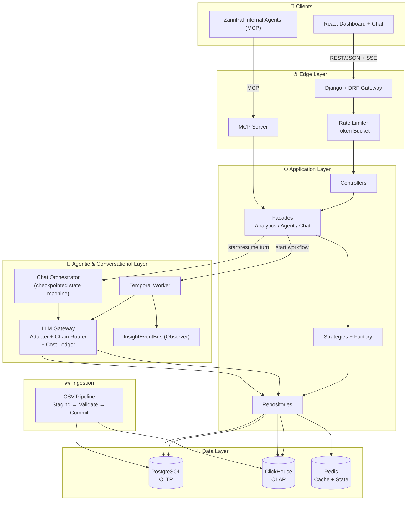
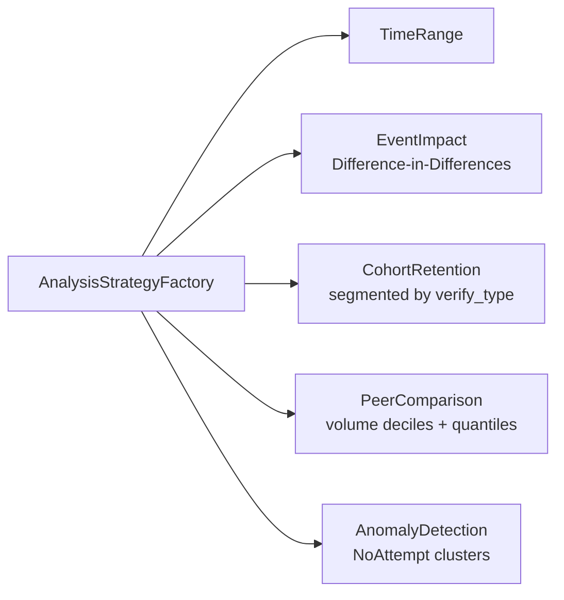

# ZarinPal Merchant Dashboard

[](https://opensource.org/licenses/MIT)
[](https://www.python.org/)
[](https://www.djangoproject.com/)
[](https://react.dev/)
[](https://www.typescriptlang.org/)
[](https://clickhouse.com/)
[](https://temporal.io/)
[](https://redis.io/)
[](https://www.docker.com/)

A production-grade merchant analytics platform powering **classical BI dashboards**, **grounded AI insight narratives**, and a **conversational "Ask the Dashboard" agent** — all built with strict traceability from every displayed number back to raw transaction rows.

> Built for ZarinPal's merchant network. Serving thousands of merchants with hundreds of thousands of daily transactions.

---

## What It Does

<table>
<tr>
<td width="50%">

### 📊 Classical BI
Pre-aggregated dashboards with drill-down, peer ranking, and anomaly detection. Every metric traces back to raw `AnalysisResult`s — no magic numbers.

### 🤖 Agentic Insights
Autonomous LLM-generated summaries grounded in computed data. Strict validation ensures every claim is traceable. Cost-aware with hard ceilings.

</td>
<td width="50%">

### 💬 Conversational Agent
Natural language Q&A ("Ask the Dashboard") that answers only from verified analysis results. Streaming delivery with multi-turn memory and graceful degradation.

### 🔌 MCP Server
Internal ZarinPal agents can query the platform as a tool with identical semantics and full provenance to the REST/browser experience.

</td>
</tr>
</table>

---

## Tech Stack

| Layer | Technology |
|-------|------------|
| **Backend API** | Django 5.2 + DRF, Python 3.11+ |
| **Frontend** | React 19, TypeScript, Vite, Tailwind CSS v4, shadcn/ui |
| **OLTP Database** | PostgreSQL 16 (merchants, auth, agent state, chat sessions) |
| **OLAP Database** | ClickHouse 24.8 (transaction facts, rollups, quantiles) |
| **Workflow Engine** | Temporal 1.25 (resumable agent workflows) |
| **Cache / State** | Redis 7 (caching, rate limiting, circuit breakers, cost ledger, chat checkpoints) |
| **LLM Gateway** | AvalAI (multi-provider, cost-tracked, circuit-breaker protected) |
| **Infrastructure** | Docker Compose, healthchecks, resource limits |

---

## Architecture



### CQRS Data Strategy

| Concern | PostgreSQL (OLTP) | ClickHouse (OLAP) |
|---------|-------------------|-------------------|
| **Holds** | Merchants, users, auth, insights metadata, chat state, cost ledger, idempotency | Transaction facts, daily/monthly rollups, peer quantiles |
| **Pattern** | Low-latency point lookups, transactional writes | High-throughput scans & aggregations |
| **Consistency** | ACID | Append-only, eventually merged |

---

## Quick Start

### Prerequisites
- Docker & Docker Compose
- Python 3.11+ (for local development)
- Node.js 20+ (for frontend development)

### 1. Clone & Configure

```bash
git clone https://github.com/your-org/ZarinPalMerchantDashboard.git
cd ZarinPalMerchantDashboard
cp .env.example .env
```

### 2. Start Infrastructure

```bash
docker compose up
```

This starts:
- **PostgreSQL** (application OLTP)
- **ClickHouse** (analytical store)
- **Redis** (cache & state)
- **Temporal** (workflow engine with its own dedicated Postgres)

### 3. Run Application Services

```bash
# Start API + Frontend (with app profile)
docker compose --profile app up

# Or run ingestion pipeline
docker compose --profile ingestion up
```

### 4. Verify

```bash
curl http://localhost:8000/api/v1/health
```

---

## Project Structure

```
ZarinPalMerchantDashboard/
├── backend/
│   ├── api/                    # Django + DRF REST API
│   │   ├── controllers/        # HTTP handlers (auth, analytics, health)
│   │   ├── facades/            # Application services (Analytics, Agent, Chat)
│   │   ├── repositories/       # Data access (Postgres, ClickHouse, Redis)
│   │   ├── analytics/          # Strategy + Factory pattern analysis engine
│   │   ├── gateway/            # LLM routing, circuit breakers, caching
│   │   ├── middlewares/         # AuthZ, rate limiting
│   │   └── tests/              # pytest suite
│   ├── ingestion/              # CSV → ClickHouse pipeline
│   ├── temporal-worker/        # Temporal workflows (insights, chat memory)
│   ├── mcp-server/             # MCP protocol server (Sprint 4)
│   ├── shared/                 # Cross-service types, DTOs, protocols
│   └── notification-worker/    # Alert dispatch worker
├── frontend/                   # React + TypeScript SPA
│   ├── src/
│   │   ├── components/         # UI components (shadcn/ui)
│   │   ├── pages/              # Route pages (Dashboard, Insights, Chat)
│   │   ├── store/              # Redux Toolkit slices
│   │   ├── api/                # HTTP client, SSE streaming
│   │   └── theme/              # Tailwind + design tokens
│   └── public/
├── docs/
│   └── spec.md                 # Engineering specification v1.5
├── docker-compose.yml          # Development environment
├── docker-compose.prod.yml     # Production overlay
├── .env.example                # Environment template
└── README.md
```

---

## Key Design Patterns

The backend applies enterprise-grade patterns consistently across REST, MCP, and chat surfaces:

| Pattern | Where | Why |
|---------|-------|-----|
| **Strategy + Factory** | Analysis engine, LLM provider routing | Open for extension; callers never branch on `kind` |
| **Repository** | All data access | Only Repositories talk to DB/Redis/ClickHouse |
| **Circuit Breaker** | LLM gateway, ClickHouse queries | Fail fast under degradation |
| **Chain of Responsibility** | Model router (Cheap → Mid → Premium) | Cost-first failover |
| **Bulkhead** | Temporal task queues (4 isolated queues) | Isolation between analysis, agent, notification, chat |
| **Observer** | `InsightEventBus` → Notifications, cache invalidation | Decouples persistence from side effects |
| **Singleton (CostLedger)** | Per-scope spend tracking (`agent` vs `chat`) | Authoritative in-process spend view |
| **Memento / Checkpoint** | Chat turn state, agent run state | Crash-safe resumption without re-billing |
| **CQRS (flavored)** | Postgres vs ClickHouse | Access-pattern match |
| **Value Object** | `FeeProxyValue` (no `.as_currency()`) | Type-level enforcement of relative-only fee semantics |

---

## Analysis Strategies



All strategies are directly reusable by the conversational agent — no duplicated logic between the dashboard and chat surfaces.

---

## Feature Highlights

### 🔒 Traceability First
Every number in the dashboard and every claim in the AI narrative traces back to a computed `AnalysisResult` with multi-query lineage records.

### 💰 Cost-Aware AI
- Per-merchant and global daily/monthly LLM budgets with hard stops
- Separate `agent` (infrequent, heavier) and `chat` (frequent, lighter) cost scopes
- Response caching and circuit breaker protection

### 🛡️ Resilience
- Circuit breaker around ClickHouse with cached fallback
- Streaming delivery with buffered fallback for chat
- Idempotent ingestion via batch registry
- 30-day chat memory consolidation with bounded retention

### 🌍 Internationalization
- Persian-first UI with Vazirmatn + Geist fonts
- RTL-aware layout
- JWT-based auth with refresh tokens and rate limiting

---

## Testing

```bash
# Backend unit tests
cd backend && pytest

# Frontend lint
cd frontend && npm run lint

# Temporal worker tests
cd backend/temporal-worker && PYTHONPATH="shared:temporal-worker:../api" python -m pytest tests/ -v
```

---

## Production Deployment

```bash
docker compose -f docker-compose.yml -f docker-compose.prod.yml up -d
```

Production overlay adds:
- `restart: unless-stopped` policies
- Resource limits per service
- Closed external ports (healthcheck-only exposure)
- Gunicorn + uvicorn workers for ASGI
- `DJANGO_DEBUG=false`

---

## Observability

| Tool | Coverage |
|------|----------|
| **OpenTelemetry** | Distributed traces (chat turns as first-class spans) |
| **Prometheus** | Metrics at `/metrics` |
| **Structured Logs** | JSON-formatted, request-id tagged |
| **Cost Ledger** | Per-merchant, per-scope LLM spend tracking |

---

## Roadmap

- [x] Sprint 0: Infrastructure & CQRS foundation
- [x] Sprint 1: CSV ingestion pipeline with idempotent commit
- [ ] Sprint 2: Classical BI dashboard (5 analysis strategies)
- [ ] Sprint 3: Conversational "Ask the Dashboard" agent
- [ ] Sprint 4: MCP server + internal agent tool exposure
- [ ] Sprint 5: Notification delivery (in-app + email)
- [ ] Sprint 6: Advanced analytics (cohort retention, event impact)

---

## Team

| Role | Member |
|------|--------|
| Backend / Data | Pourya |
| Backend / Agentic & Conversational | Mamad |
| Frontend | Ali |

---

## Contributing

1. Fork the repository
2. Create a feature branch (`git checkout -b feature/amazing-feature`)
3. Commit your changes (`git commit -m 'Add amazing feature'`)
4. Push to the branch (`git push origin feature/amazing-feature`)
5. Open a Pull Request

Please read [`docs/spec.md`](docs/spec.md) for architecture and design-pattern guidelines.

---

## License

This project is licensed under the **MIT License** — see the [LICENSE](LICENSE) file for details.

Copyright (c) 2026 Mostafa Mashhadizadeh

---

<p align="center">
  Built with ❤️ for <a href="https://www.zarinpal.com">ZarinPal</a>
</p>
