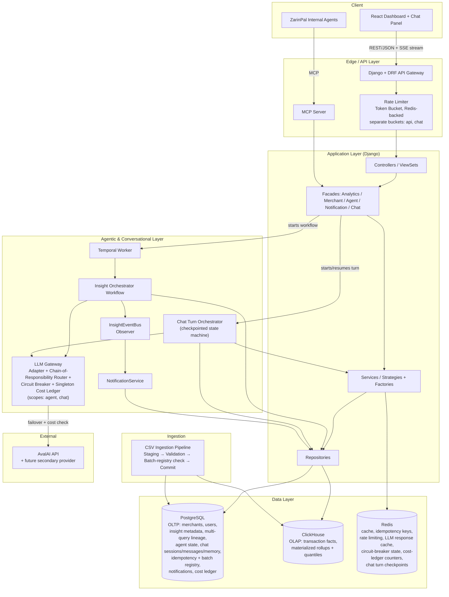
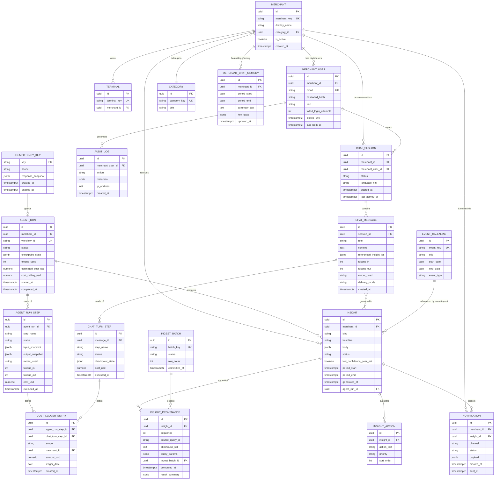
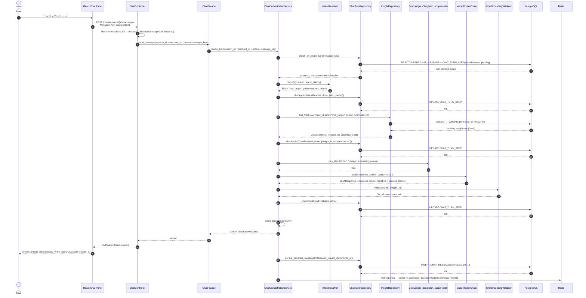
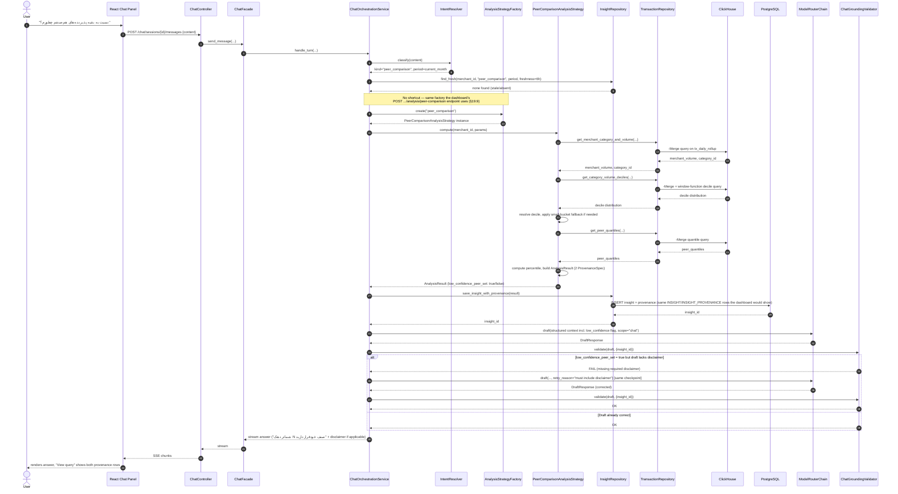
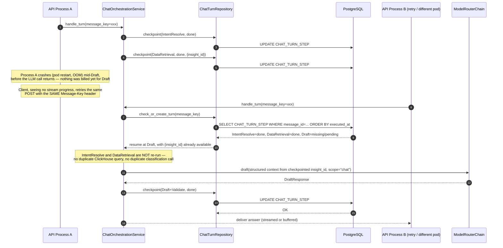
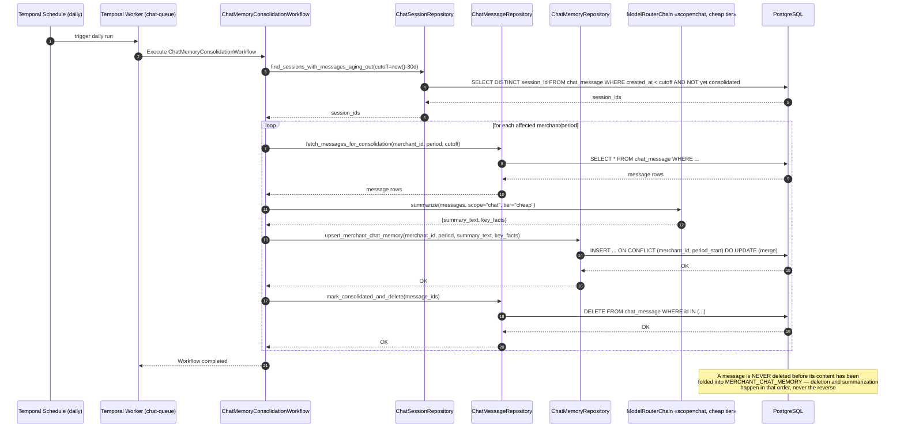
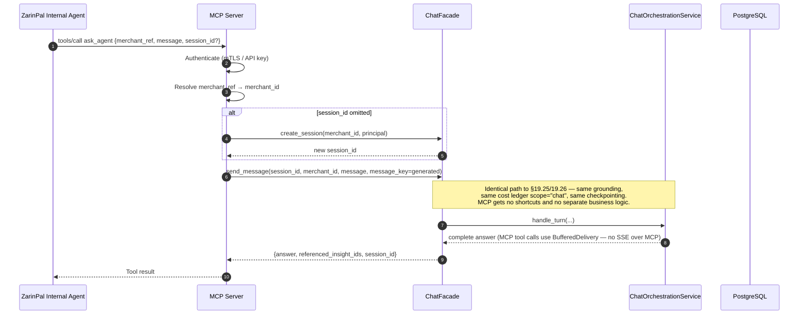

# ZarinPal Merchant Dashboard — Engineering Specification

**Status:** Draft v1.5 (Production-Ready, Correctness-Hardened, Pattern-Complete, Sequence-Complete, Conversational-Agent-Complete)
**Team:** Pourya (Backend / Data), Mamad (Backend / Agentic & Conversational), Ali (Frontend)
**Stack:** Django + DRF, React, PostgreSQL, ClickHouse, Temporal, Redis, AvalAI (LLM gateway, multi-provider capable)
**Target:** Production deployment
**Last Updated:** 2026-08-20

---

## 1. Purpose & Scope

ZarinPal wants a merchant-facing analytics platform that gives each merchant actionable, traceable insight into their own transaction data. The platform combines:

- A classical BI-style dashboard with pre-aggregated metrics, peer ranking, and drill-down.
- An **agentic** layer that autonomously generates written insight summaries with strict grounding/validation.
- A **conversational agent ("Ask the Dashboard")** that lets a merchant chat with the platform in natural language — asking about their own numbers, comparing themselves to peers, and getting explanations — with the same correctness guarantees as the rest of the system: every number the bot states must be traceable back to a computed `AnalysisResult`, never invented.
- An MCP server so ZarinPal's internal agents can query the platform — and, where useful, converse with it — as a tool with identical semantics and full provenance to the REST/browser experience.

The platform must be engineered, not merely built: explicit design patterns applied consistently from the class diagrams down into the runtime call sequences, defensible architecture, cost-aware LLM usage with hard ceilings, resilience under partial failure, full multi-query lineage from any displayed number back to the raw rows, and clear operational boundaries. ZarinPal operates at a scale of several thousand active merchants and several hundred thousand transactions per day; every design decision in this document — classical analytics, agentic summaries, and the conversational agent alike — is made with that load in mind, not as an afterthought bolted on later.

This document is the **single source of truth** for architecture, data model, API contracts, operational concerns, testing strategy, sequence diagrams, and evaluation criteria mapping.

**Evaluation axes addressed:**
- Actionability & novelty
- Correctness & traceability
- Analytical depth
- Non-technical UX
- Technical quality & runnability
- Conversational usefulness & safety (new)

**Design-pattern discipline:** every pattern named in §6 must be *visible* in at least one sequence diagram in §19 as an explicit participant or explicit branch — not just claimed in prose. Where a pattern has runtime state (Circuit Breaker, Singleton cost ledger, Chain of Responsibility router, conversational turn checkpoint), the diagrams show that state being read and mutated, not just the happy path. This discipline applies identically to the classical, agentic, and conversational layers — the conversational agent is not exempt from any pattern requirement placed on the rest of the system.

---

## 2. Dataset Analysis (Grounded in the Provided Sample and Column Guide)

All design decisions start from the actual CSV schema and observed behavior, cross-checked against the dataset column guide supplied by ZarinPal. The full ~50 MB file must be re-verified during ingestion-pipeline development (exact row count, cardinality of `merchant_key`, null rates segmented by status, max tries per session, distribution of `try_seq`).

### 2.1 Grain of the Data

The dataset is **one row per payment attempt (try)**, grouped under a **payment session** (`session_key`). Session-level fields (amount, merchant, category, etc.) repeat across every row belonging to the same session. This is the single most important structural fact.

- `session_key` identifies one checkout session (one purchase intent).
- `try_seq` is the attempt number within that session, starting at 1. `try_seq = 0` is reserved and means the session had no payment attempt at all.
- `try_status = NoAttempt` (only a valid value of `try_status`, never of `session_status`) paired with `try_seq = 0` means the payer never reached bank selection (true drop-off).
- A single session can contain many tries (observed in sample: 8–22 tries with PSP rotation via `switch_response_code` values).
- `session_status` is the final session-level outcome. Its full value set is `Verified`, `Paid`, `InBank`, `Failed`, `Reversed`.
- `try_status` is per-attempt: `NoAttempt`, `Failed`, `InBank`, `Verified`, `Paid`, `Reversed`.

**Payment lifecycle (from the column guide):**

```
Merchant creates a payment request → session is created
User is redirected to the bank gateway → InBank
Bank debits the card → Paid
Merchant verifies the transaction → Verified
```

| Value | Meaning |
|---|---|
| `Verified` | Payment completed and the merchant has verified it — final, complete state |
| `Paid` | Amount debited from the payer's card, but the merchant has not yet verified the transaction |
| `InBank` | User was redirected to the bank gateway but no result has returned yet |
| `Failed` | The attempt/session failed |
| `Reversed` | Funds were reversed |
| `NoAttempt` | (`try_status` only) — no payment attempt at all was recorded for the session |

**Critical implication:**
All session-level aggregations **must** use `uniqExact(session_key)` (or equivalent).
Never assume every session has a row with `try_seq = 1`. Sessions that only contain `try_seq = 0` + `NoAttempt` are valid and must be counted. `Verified` and `Paid` are both settlement-positive outcomes but are **not interchangeable** — any metric describing "successful/completed revenue" must state explicitly whether it includes `Paid`-but-unverified sessions, since an unverified `Paid` session is not yet a merchant-confirmed transaction. Metrics that need a strictly final outcome should filter to `Verified` only; metrics that need "money actually moved" should include `Verified` + `Paid`. `Reversed` sessions must be excluded from gross revenue/volume metrics and, where material, surfaced as their own segment (a chargeback/reversal-rate view is a natural future analysis kind, out of scope for this phase but the `session_status` enum already supports it without a schema change).

### 2.2 Structural Nullability (Status-Conditional)

Several columns are null **by construction**, not due to data-quality problems:

| Column                        | Populated when                          | Null when                          |
|-------------------------------|-----------------------------------------|-------------------------------------|
| `switch_response_code`        | The switch returned a response code for this attempt | The attempt never reached the switch |
| `psp_code`                    | This attempt passed through a PSP       | No attempt was made                 |
| `issuer_bank_code`, `payer_card_key` | The payment reached the bank and card info was returned | The user abandoned the payment or the bank never accepted it — card info never returns in this case |
| `verify_time_ms`, `verified_at` | Attempt reached verification          | Failed earlier                      |
| `settled_at`                  | Session ultimately settled               | Session not settled                 |
| `expire_in`                   | Always present (it is a deadline/TTL marker on the session) | —                        |
| `try_created_at`              | An attempt exists for this row          | Row represents a `try_seq = 0` / `NoAttempt` session with no attempt |

**Rule:** Any null-rate or completeness metric in the analytics layer **must** be reported segmented by `try_status` / `session_status`. Global null percentages are forbidden and would fail the correctness criterion.

**PSP code namespacing (important ingestion-validation detail):** each PSP (payment switch provider) owns its own response-code space — the same numeric code means different things at different PSPs. `switch_response_code` is therefore always stored PSP-qualified, in the exact form `PSP-xx:code` (e.g. `PSP-05:56`). Ingestion validation must reject any row where this column is non-null but does not match the `PSP-\d+:.+` shape, and must never attempt to interpret the numeric part of the code in isolation — no lookup table for code meanings is provided or assumed. Any anomaly-detection or narrative logic that references a switch code must treat it as an opaque, PSP-scoped string, never decode it into a claimed meaning.

**`payer_card_key` scope (important correctness detail, affects `CohortRetentionAnalysisStrategy`):** this identifier is unique **within a single merchant only** — the same physical card used at two different merchants produces two different, unrelated `payer_card_key` values. Cohort/retention logic, and any future cross-merchant fraud-pattern work, must never compare `payer_card_key` values across merchants; they are not a global customer identifier and must not be treated as one.

**Timing columns are API latency, not user think-time:** `init_time_ms` and `verify_time_ms` measure how long the *gateway's own API call* took to respond at that step — they say nothing about how long the payer spent deliberating or navigating the bank UI. Any analysis or narrative that surfaces these fields (e.g. a p95 init-time metric on the dashboard) must describe them as gateway/API responsiveness, never as "how long the customer took" — that framing would be factually wrong and must be treated as a grounding violation if an LLM-drafted narrative makes that mistake (see §9.6.4).

### 2.3 Volume Concentration

The sample already shows heavy skew: a handful of `merchant_key` values (`M215`, `M210`, `M43`) generate a disproportionate share of rows. Within a single merchant, one `terminal_key` can dominate.

**Requirement:** The analytics layer must support **per-merchant percentile / rank framing** ("you are in the top 5% of your category by volume") rather than raw counts. Raw counts without concentration-aware normalization are meaningless for both UX and analytical correctness — this applies equally to the dashboard cards (§12) and to any conversational answer to a comparative question (§9.6).

**Volume-decile algorithm (explicit, executed inside `PeerComparisonAnalysisStrategy`, and reused as-is by the conversational agent for peer-comparison questions — see §9.6.2):**
1. For the requested period, compute each merchant's gross volume inside the same `category_id` using `category_daily_rollup` (`-Merge` aggregation, never raw `tx_raw` scans).
2. Rank merchants by volume using `quantileExact`-derived deciles (`ntile(10)` equivalent, computed in the repository as a window function over the merchant volume list, not in application code, to keep it a single ClickHouse round-trip).
3. Peer comparison is performed only against merchants in the same category **and** same volume decile.
4. **Small-bucket fallback:** if the resolved decile contains fewer than 8 merchants, widen to ±1 decile. If still fewer than 8, widen to the whole category and flag the result as `low_confidence_peer_set: true` in the `AnalysisResult`, which the UI (and the conversational agent's phrasing) renders as a muted disclaimer instead of a hard percentile claim.
5. The merchant's own percentile position is computed with `quantileExact(amount_or_volume)` inverse lookup, not a naive `COUNT(*) WHERE volume < mine` scan, to keep the query O(rollup rows) rather than O(raw rows).

### 2.4 Candidate Anomaly Pattern (Novelty Source)

Merchant `M215` shows repeated `NoAttempt` sessions with identical or near-identical large amounts (e.g. `198000000` Rial) within minutes of each other from the same terminal, later followed by a successful attempt at a different amount.

This pattern — repeated abandoned sessions at a fixed high amount, same terminal, tight time window — is a natural candidate for a **checkout-friction / possible card-testing anomaly detector**.

**Heuristic (explicit, used by `AnomalyDetectionAnalysisStrategy`, see §7.6):**
- Window: rolling 30 minutes.
- Cluster condition: ≥ 4 sessions from the same `terminal_key`, with `try_status = 'NoAttempt'`, where `amount` values fall within a ±2% band of each other.
- Severity scoring: `min(1.0, cluster_size / 10)` combined with a recency boost if the cluster occurred in the last 24 hours.
- Any cluster scoring above `0.4` becomes an `AnalysisResult` candidate; the Strategy does **not** decide whether to notify the merchant — that decision belongs to the Observer pipeline in §9.5, keeping detection and notification decoupled.

### 2.5 Fee Interpretation Constraint

`adjusted_fee` is a uniformly-scaled **proxy**, never the real fee charged by ZarinPal. The uniform scaling is deliberate: because every row is adjusted by the same fixed factor, relative relationships — ordering, trend over time, share-of-revenue — remain valid for analysis even though the absolute figure is not the real fee.

The system enforces this at the type level via the `FeeProxyValue` value object (see §6.1). Every place `adjusted_fee` is surfaced in the UI, the API, or a conversational answer must present it **only** as a relative metric (rank, share-of-revenue, trend). Absolute currency claims are forbidden by construction — this includes the chat layer: the grounding validator in §9.6.4 explicitly checks that no chat response renders a fee-proxy number with a currency unit attached.

### 2.6 Currency

All `amount` and `adjusted_fee` values are Iranian Rial, stored as integers (no fractional Rial). No currency conversion is required; only formatting and localization.

### 2.7 Identifier Anonymity

All identifiers in the dataset — `session_key`, `terminal_key`, `merchant_key`, `payer_card_key`, `issuer_bank_code` — are pseudonymous and do not reference any real-world identity, name, or account number. No part of the system (dashboard, agentic narrative, or conversational agent) should ever imply that these identifiers can be resolved to a real identity; this is a factual property of the dataset, not a policy choice, and narratives should not editorialize about it.

---

## 3. Non-Functional Requirements

| Requirement                              | Design Response                                      | Section |
|-------------------------------------------|-----------------------------------------------------------|---------|
| Thousands of merchants, hundreds of thousands of tx/day | ClickHouse OLAP + Postgres read replicas + Redis cache | 5, 7, 10 |
| Daily / seasonal / annual analysis        | Pre-aggregated materialized views + quantile support   | 5.4, 7 |
| High load, well-known patterns            | CQRS, Repository, Strategy + Factory, Circuit Breaker, Bulkhead, Chain of Responsibility, Observer, Singleton | 6, 9, 10, 19 |
| Low & controlled LLM token cost (agentic **and** conversational) | Adapter-wrapped provider + Chain-of-Responsibility model router + Singleton cost ledger with per-scope budgets + response cache + hard cost ceilings + bounded context windows + state-resume | 9.3, 9.6.5 |
| Fast, resumable agent, no cost blow-up    | Temporal workflow (agentic) / lightweight checkpointed turn state machine (conversational) with durable state + activity-level retry from checkpoint + explicit crash-resume diagram | 9.2, 9.6.3, 19.19 |
| Idempotent retries, no side effects       | Batch registry (check-and-commit) + deterministic workflow IDs + idempotency keys + chat turn checkpoints | 10.2 |
| No single-provider lock-in                | AvalAI multi-model routing behind `LLMProviderAdapter` interface + Chain of Responsibility failover; interface designed so a second provider is one new Adapter class, not a refactor | 9.3, 19.17 |
| MCP exposure (classical + conversational) | Dedicated MCP process sharing the exact same Facade layer, including `ChatFacade` | 9.4, 9.6.7, 11 |
| Traceable insights (including chat answers) | Multi-query lineage records + grounding validation step, applied identically to agentic narratives and chat turns | 8, 9.6.4 |
| Merchant-facing alerting                  | Observer (`InsightEventBus`) decoupling insight persistence from notification delivery | 9.5, 19.18 |
| Non-technical UX                          | Headline-first cards, charts collapsed by default, conversational answers in plain language by default | 12 |
| Real-time, responsive conversational experience | Streaming delivery with buffered fallback, synchronous reuse of already-fast classical strategies, cache-first answer strategy | 9.6.1, 9.6.6 |
| Multi-turn memory with bounded retention  | 30-day raw message retention + indefinite rolling conversational-memory digest | 9.6.3 |
| Full production deployment                | Docker Compose + healthchecks + resource limits        | 14 |
| Observability                             | OpenTelemetry traces + Prometheus metrics + structured logs, covering chat turns as first-class spans | 15 |
| Cost ceilings, separated by usage pattern | Per-merchant and global daily/monthly LLM budgets with hard stops, enforced by a single-process-wide `CostLedger` Singleton backed by Redis, scoped separately for `agent` (infrequent, heavier) vs `chat` (frequent, lighter, real-time) spend | 9.3, 9.6.5, 19.24 |
| Security & isolation                      | Object-level AuthZ, merchant-scoped queries by construction, token-bucket rate limiting (separate, more lenient bucket for chat) | 13, 19.22 |
| Data retention                            | 24-month hot ClickHouse, then cold archive; 30-day hot chat history, then summarized digest | 5.5, 9.6.3 |
| Graceful analytical degradation           | Circuit Breaker around heavy ClickHouse queries, falling back to last-known-good cached rollups; conversational agent falls back to buffered (non-streaming) delivery, and further to a templated deterministic answer, when upstream degrades | 10.3, 19.12, 9.6.6 |

---

## 4. High-Level Architecture



**Layering (strict and non-negotiable):**

- **Controller** (DRF `APIView` / `ViewSet`, or the SSE-streaming view for chat): HTTP concerns only — authentication, request validation, status codes, serialization/streaming framing.
- **Facade / Application Service**: one per bounded context (`AnalyticsFacade`, `AgentFacade`, `MerchantFacade`, `NotificationFacade`, `ChatFacade`). This is the **single shared entry point** used by REST controllers, the MCP server, and (for chat) both the browser panel and the future MCP `ask_agent` tool. It orchestrates services but contains no business rules.
- **Service / Strategy / Factory**: pure business logic. Each analysis type implements the `AnalysisStrategy` protocol and is produced by `AnalysisStrategyFactory` — controllers and facades never `if/elif` over analysis kind. The conversational agent's tool-routing layer (§9.6.2) reuses this exact factory rather than re-implementing analysis dispatch.
- **Repository**: data-access abstraction. Services never issue raw SQL or ClickHouse queries directly. **Only Repositories talk to databases.**

This layering guarantees that REST, MCP, and chat can never diverge in business logic and that sequence diagrams stay clean. Every diagram in §19 obeys it, including the conversational ones.

---

## 5. Data Layer

### 5.1 Why Two Databases (CQRS-flavored)

| Concern              | PostgreSQL                                      | ClickHouse                                              |
|-----------------------|----------------------------------------------------|-------------------------------------------------------------|
| Role                  | OLTP system-of-record                              | OLAP analytical store                                        |
| Holds                 | Merchants, users, auth, terminals, insight metadata, multi-query lineage, agent workflow state, chat sessions/messages/memory, idempotency ledger, batch registry, audit log, event calendar, notifications, cost ledger entries | Raw transaction facts, daily/monthly rollups, peer quantiles |
| Access pattern        | Low-latency point lookups, transactional writes    | High-throughput scans & aggregations over large volumes      |
| Consistency           | ACID                                                | Append-only, eventually merged (no application-level dedup needed — see §5.4) |

Chat never gets its own database. Conversational state is OLTP by nature (small rows, high write frequency, point lookups by session) and belongs in PostgreSQL exactly like agent-run state; the conversational agent reads transactional facts **only** through the same `TransactionRepository` / rollup path every other analysis consumer uses. There is no separate "chat data path" into ClickHouse.

### 5.2 Identifier Rule (Critical Consistency Fix)

- External API and MCP endpoints accept **either** `merchant_key` (string, e.g. `M215`) **or** the internal UUID.
- All internal code, foreign keys, and AuthZ checks use the UUID.
- Controllers / MCP tool handlers resolve `merchant_key` → UUID exactly once at the edge and pass only the UUID thereafter. The chat Controller resolves `merchant_ref` at session-creation time and stores the UUID on `CHAT_SESSION`; every subsequent turn in that session reuses the stored UUID rather than re-resolving it, but AuthZ is still re-checked on every turn (see §13).

### 5.3 PostgreSQL Schema (ER) — Complete



**Required indexes (PostgreSQL):**
- `MERCHANT(merchant_key)` unique
- `INGEST_BATCH(batch_key)` unique
- `AGENT_RUN(workflow_id)` unique
- `INSIGHT(merchant_id, period_start, period_end, kind)`
- `INSIGHT_PROVENANCE(insight_id, sequence)`
- `AUDIT_LOG(merchant_user_id, created_at)`
- `EVENT_CALENDAR(start_date, end_date)`
- `NOTIFICATION(merchant_id, status, created_at)`
- `COST_LEDGER_ENTRY(scope, merchant_id, ledger_date)` — supports the daily-sum queries the Singleton `CostLedger` issues on cold start / cache miss, for **both** the `agent` and `chat` scopes (see §9.3, §9.6.5)
- `MERCHANT_USER(email)` unique, `MERCHANT_USER(locked_until)` partial index `WHERE locked_until IS NOT NULL`
- `CHAT_SESSION(merchant_id, last_activity_at)`
- `CHAT_MESSAGE(session_id, created_at)`
- `CHAT_TURN_STEP(message_id)`
- `MERCHANT_CHAT_MEMORY(merchant_id, period_start)`

### 5.4 ClickHouse Schema (Idempotent Ingestion, Corrected Column Names)

```sql
-- Staging (transient)
CREATE TABLE tx_staging
(
    session_key          UInt64,
    try_seq              UInt16,
    terminal_key         String,
    merchant_key         String,
    category_id          String,
    category_title       String,
    amount               UInt64,
    adjusted_fee         UInt64,
    session_status       LowCardinality(String),
    try_status            LowCardinality(String),
    switch_response_code LowCardinality(String),
    psp_code              LowCardinality(String),
    issuer_bank_code      LowCardinality(String),
    payer_card_key       String,
    verify_type            LowCardinality(String),  -- 'Automated' | 'Manual'
    init_time_ms          Nullable(UInt32),
    verify_time_ms        Nullable(UInt32),
    created_at            DateTime,
    try_created_at        Nullable(DateTime),
    verified_at            Nullable(DateTime),
    settled_at             Nullable(DateTime),
    expire_in               DateTime,
    ingest_batch_id        UUID
)
ENGINE = MergeTree
ORDER BY (merchant_key, created_at, session_key, try_seq)
TTL created_at + INTERVAL 7 DAY;

-- Final fact table
CREATE TABLE tx_raw
(
    session_key          UInt64,
    try_seq              UInt16,
    terminal_key         String,
    merchant_key         String,
    category_id          String,
    category_title       String,
    amount               UInt64 CODEC(Delta, ZSTD(3)),
    adjusted_fee         UInt64 CODEC(Delta, ZSTD(3)),
    session_status       LowCardinality(String),
    try_status            LowCardinality(String),
    switch_response_code LowCardinality(String),
    psp_code              LowCardinality(String),
    issuer_bank_code      LowCardinality(String),
    payer_card_key       String,
    verify_type            LowCardinality(String),
    init_time_ms          Nullable(UInt32),
    verify_time_ms        Nullable(UInt32),
    created_at            DateTime CODEC(Delta, ZSTD(3)),
    try_created_at        Nullable(DateTime),
    verified_at            Nullable(DateTime),
    settled_at             Nullable(DateTime),
    expire_in               DateTime,
    ingest_batch_id        UUID
)
ENGINE = MergeTree
PARTITION BY toYYYYMM(created_at)
ORDER BY (merchant_key, created_at, session_key, try_seq);

-- Daily merchant rollup
CREATE MATERIALIZED VIEW tx_daily_rollup
ENGINE = AggregatingMergeTree
PARTITION BY toYYYYMM(day)
ORDER BY (merchant_key, day)
AS
SELECT
    merchant_key,
    toDate(created_at) AS day,
    uniqExactState(session_key)                                                      AS sessions_started_state,
    uniqExactIfState(session_key, session_status IN ('Verified','Paid'))              AS sessions_succeeded_state,
    uniqExactIfState(session_key, session_status = 'Reversed')                        AS sessions_reversed_state,
    sumIfState(amount, session_status IN ('Verified','Paid'))                         AS gross_volume_state,
    sumIfState(adjusted_fee, session_status IN ('Verified','Paid'))                   AS gross_fee_proxy_state,
    avgIfState(try_seq, session_status IN ('Verified','Paid'))                        AS avg_try_seq_on_success_state,
    countIfState(try_status = 'NoAttempt')                                            AS abandoned_before_attempt_state,
    quantileTimingState(0.5)(init_time_ms)                                            AS p50_init_ms_state,
    quantileTimingState(0.95)(init_time_ms)                                           AS p95_init_ms_state
FROM tx_raw
GROUP BY merchant_key, day;

-- Peer / category daily rollup
CREATE MATERIALIZED VIEW category_daily_rollup
ENGINE = AggregatingMergeTree
PARTITION BY toYYYYMM(day)
ORDER BY (category_id, day)
AS
SELECT
    category_id,
    toDate(created_at) AS day,
    uniqExactState(merchant_key)                                         AS active_merchants_state,
    uniqExactState(session_key)                                          AS category_sessions_state,
    sumIfState(amount, session_status IN ('Verified','Paid'))            AS category_gross_volume_state,
    avgIfState(amount, session_status IN ('Verified','Paid'))            AS category_avg_ticket_state,
    quantileState(0.5)(amount)                                           AS category_median_ticket_state,
    quantileState(0.9)(amount)                                           AS category_p90_ticket_state,
    quantileState(0.95)(amount)                                          AS category_p95_ticket_state
FROM tx_raw
GROUP BY category_id, day;

-- Terminal-level rolling window helper for anomaly detection (materialized incrementally,
-- read by AnomalyDetectionAnalysisStrategy — see §7.6)
CREATE MATERIALIZED VIEW terminal_noattempt_clusters
ENGINE = AggregatingMergeTree
PARTITION BY toYYYYMM(bucket_start)
ORDER BY (terminal_key, bucket_start)
AS
SELECT
    terminal_key,
    merchant_key,
    toStartOfInterval(created_at, INTERVAL 30 MINUTE) AS bucket_start,
    round(amount, -4)                                  AS amount_bucket,
    countState()                                        AS cluster_size_state,
    minState(created_at)                                AS first_seen_state,
    maxState(created_at)                                AS last_seen_state
FROM tx_raw
WHERE try_status = 'NoAttempt'
GROUP BY terminal_key, merchant_key, bucket_start, amount_bucket;
```

**Corrections applied in this revision (reflected directly above, per the dataset column guide):**
- Session-terminal column renamed `expire_at` → `expire_in`, matches the source CSV exactly, and is now `NOT NULL` (it is always present, per §2.2).
- `try_created_at` is `Nullable` (a `try_seq = 0` / `NoAttempt` row has no attempt timestamp).
- `session_status` now explicitly documented (and validated at ingestion) to include `Reversed`, in addition to `Verified` / `Paid` / `InBank` / `Failed`.
- `tx_daily_rollup` gains `sessions_reversed_state` so reversal volume is queryable through the same `-Merge` pattern as everything else, without a raw scan.
- `switch_response_code` validation must enforce the `PSP-xx:code` shape (§2.2) — added as an explicit ingestion-validation rule, not just a DDL type.
- `verify_type` is explicitly `'Automated' | 'Manual'` — this is the segmentation axis `CohortRetentionAnalysisStrategy` (§7.5) already required; the value set is now documented rather than assumed.

**Ingestion Pipeline (Idempotent by Registry):**

1. Compute `batch_key = sha256(file_content)`.
2. Attempt `INSERT INTO INGEST_BATCH (batch_key, status='staging')`. Unique constraint is the single gate — duplicate file is rejected before any ClickHouse write.
3. Load into `tx_staging` with the new `ingest_batch_id` (UUID).
4. Validate schema + status-conditional nulls + the `switch_response_code` PSP-prefix shape.
5. On success: `INSERT INTO tx_raw SELECT ... FROM tx_staging WHERE ingest_batch_id = :id`, mark `status = 'committed'`.
   On failure: mark `status = 'failed'`, leave `tx_raw` untouched; staging TTL cleans up.
6. Every `INSIGHT_PROVENANCE` points to this exact `INGEST_BATCH.id`.

**Reading Aggregated State (mandatory pattern):**

```sql
SELECT
    merchant_key,
    sum(day_sessions) AS sessions_started,
    sum(day_succeeded) AS sessions_succeeded,
    sum(day_gross_volume) AS gross_volume
FROM (
    SELECT
        merchant_key,
        day,
        uniqExactMerge(sessions_started_state) AS day_sessions,
        uniqExactIfMerge(sessions_succeeded_state) AS day_succeeded,
        sumMerge(gross_volume_state) AS day_gross_volume
    FROM tx_daily_rollup
    WHERE merchant_key = {merchant_key:String}
      AND day BETWEEN {start:Date} AND {end:Date}
    GROUP BY merchant_key, day
)
GROUP BY merchant_key;
```

Every `TransactionRepository` method — whether called from a REST controller, the agentic workflow, or the conversational orchestrator — **must** use this `-Merge` pattern. Automated tests in §16 assert it. The conversational agent never gets a shortcut path into `tx_raw`; it calls the exact same `TransactionRepository` methods the dashboard uses (see §9.6.2).

### 5.5 Data Retention

- Hot data in ClickHouse: 24 months.
- After 24 months: move partitions to cold storage (S3 / object storage) via ClickHouse TTL + move-to-disk.
- PostgreSQL insight/provenance/notification/cost-ledger records kept indefinitely (small volume).
- Staging partitions auto-expire after 7 days.
- `CHAT_MESSAGE` raw rows: retained 30 days, then deleted after being folded into `MERCHANT_CHAT_MEMORY` (see §9.6.3) — never dropped without first being summarized.
- `MERCHANT_CHAT_MEMORY` rows: retained indefinitely (small volume, one row per merchant per consolidation period).

---

## 6. Design Patterns Catalog

| Pattern                              | Where (class)                                       | Where (sequence diagram) | Why |
|----------------------------------------|-----------------------------------------------------------|--------------------------------|-----|
| Controller → Facade → Service/Strategy → Repository | Whole backend, including chat                  | All of §19                | Strict separation; shared logic between REST, MCP, and chat |
| Strategy                             | `AnalysisStrategy` (5 concrete implementations), `LLMProviderStrategy`, `ChatResponseDeliveryStrategy` (streaming vs buffered) | 19.7–19.11, 19.16, 19.17, 19.26 | Open for extension, one class per analysis kind / delivery mode |
| Factory                              | `AnalysisStrategyFactory`, `LLMProviderStrategyFactory` (aka the Chain builder) | 19.7–19.11, 19.16 | Callers never branch on `kind`; adding a new analysis type never touches the Facade |
| Repository                           | Transaction, Insight, AgentRun, IngestBatch, Notification, CostLedger, ChatSession, ChatMessage, ChatMemory | All of §19 | Only place that talks to DB/Redis/ClickHouse |
| Adapter                              | `AvalAIAdapter` implementing `LLMProviderAdapter`     | 19.16, 19.17, 19.25       | Swappable provider without touching orchestration code; used identically by the agentic and chat call sites |
| Chain of Responsibility               | `ModelRouterChain` (Cheap → Mid → Premium handlers), shared by agent and chat callers | 19.17, 19.25 | Cost-first failover, each handler decides "can I serve this?" before passing on |
| Circuit Breaker                      | `LLMCircuitBreaker` (per model tier), `ClickHouseCircuitBreaker` (heavy-query executor) | 19.12, 19.17, 19.25 | Fail fast, stop hammering a degraded dependency, recover via half-open probe |
| Bulkhead                             | Separate Temporal task queues (`analysis-queue`, `agent-queue`, `notification-queue`); chat runs on a dedicated in-process worker pool / task queue (`chat-queue`) so a chat spike cannot starve agent workflows or vice versa | 19.16, 19.19, 19.25 | Isolation |
| Saga / Workflow (Temporal)           | `InsightGenerationWorkflow`; `ChatMemoryConsolidationWorkflow` (scheduled) | 19.16, 19.19, 19.28        | Resumable multi-step, survives worker crash |
| Memento / Checkpoint                 | `CHAT_TURN_STEP.checkpoint_state`, mirroring `AGENT_RUN.checkpoint_state` but lightweight (no full Temporal workflow per turn) | 19.25, 19.27               | A crashed or retried chat turn resumes from its last completed step instead of re-running (and re-billing) earlier steps |
| CQRS (flavored)                      | Postgres vs ClickHouse                                 | 19.4, 19.7–19.11           | Access-pattern match |
| Value Object                         | `FeeProxyValue`, `Money`                               | n/a (type-level)           | Type-level fee protection, enforced identically in chat output |
| Idempotency Key / Registry           | `INGEST_BATCH`, `IDEMPOTENCY_KEY`, `CHAT_TURN_STEP`     | 19.13, 19.15, 19.20, 19.25 | Safe retries |
| Observer                             | `InsightEventBus` → `NotificationService`, `CacheInvalidationListener` | 19.18                | Decouples insight persistence from downstream side effects |
| Singleton                            | `CostLedger` (per-process, Redis-synchronized, multi-scope: `agent`, `chat`) | 19.16, 19.24, 19.25        | One authoritative in-process view of spend per scope, never re-instantiated mid-run |
| Cache-Aside                          | Redis (dashboard summary, LLM response cache, chat "answer from existing insight" cache) | 19.4, 19.7, 19.25          | Performance + cost |
| Token Bucket                         | `RateLimiter` middleware — separate buckets for `api` and `chat` | 19.22                       | Per-merchant / per-API-key fairness, tuned differently for high-frequency chat |
| Facade (dedicated)                   | `ChatFacade`, the single shared entry point for chat across REST, MCP, and (implicitly) any future surface | 19.25–19.29 | Guarantees browser chat and MCP `ask_agent` can never diverge in behavior |

### 6.1 FeeProxyValue Guardrail

```python
from dataclasses import dataclass
from typing import Sequence

@dataclass(frozen=True)
class FeeProxyValue:
    """Deliberately has NO .as_currency() / .to_rial() method."""
    _raw: int

    def rank_within(self, peers: Sequence["FeeProxyValue"]) -> float: ...
    def share_of_revenue(self, gross: "Money") -> float: ...
    def trend_vs(self, other: "FeeProxyValue") -> float: ...
```

### 6.2 AnalysisStrategyFactory

```python
from typing import Protocol, Dict, Type

class AnalysisStrategy(Protocol):
    def compute(self, merchant_id: "UUID", params: "AnalysisParams") -> "AnalysisResult": ...
    def required_provenance(self) -> list["ProvenanceSpec"]: ...

class AnalysisStrategyFactory:
    """
    Single point of truth mapping an analysis 'kind' string to a Strategy class.
    Controllers/Facades — including ChatFacade's tool-routing layer — call
    factory.create(kind) and never import a concrete Strategy class directly.
    """
    _registry: Dict[str, Type[AnalysisStrategy]] = {
        "time_range": "TimeRangeAnalysisStrategy",
        "event_impact": "EventImpactAnalysisStrategy",
        "cohort_retention": "CohortRetentionAnalysisStrategy",
        "peer_comparison": "PeerComparisonAnalysisStrategy",
        "anomaly_detection": "AnomalyDetectionAnalysisStrategy",
    }

    def create(self, kind: str) -> AnalysisStrategy: ...
```

### 6.3 LLM Provider Chain of Responsibility + Adapter

```python
from typing import Optional

class LLMProviderAdapter(Protocol):
    """Normalizes AvalAI's (or any future provider's) request/response shape
    into the orchestrator's internal DraftRequest / DraftResponse contract.
    Used identically by the agentic Orchestrator and the Chat Turn Orchestrator —
    neither has its own copy of provider-specific wire logic."""
    def complete(self, request: "DraftRequest") -> "DraftResponse": ...
    def stream(self, request: "DraftRequest") -> "Iterator[DraftChunk]": ...

class ModelTierHandler:
    """One link in the Chain of Responsibility. Each tier decides locally
    whether it is allowed to serve (circuit closed/half-open AND under its
    own cost sub-ceiling FOR THE CALLING SCOPE) before either serving or
    delegating to `next_`."""
    def __init__(self, tier: str, adapter: LLMProviderAdapter,
                 breaker: "LLMCircuitBreaker", next_: Optional["ModelTierHandler"]):
        self.tier, self.adapter, self.breaker, self.next_ = tier, adapter, breaker, next_

    def handle(self, request: "DraftRequest", ledger: "CostLedger", scope: str) -> "DraftResponse":
        if self.breaker.allow_request() and ledger.can_afford(scope, self.tier, request.estimated_tokens):
            try:
                response = self.adapter.complete(request)
                self.breaker.record_success()
                ledger.debit(scope, self.tier, response.tokens_in, response.tokens_out)
                return response
            except ProviderError:
                self.breaker.record_failure()
        if self.next_ is None:
            raise AllProvidersExhausted()
        return self.next_.handle(request, ledger, scope)

# Wiring order = cost-ascending: cheap -> mid -> premium
# The SAME chain instance is reused by both the agentic Orchestrator (scope="agent")
# and the Chat Turn Orchestrator (scope="chat") — only the scope argument differs.
chain = ModelTierHandler("cheap", cheap_adapter, cheap_breaker,
            ModelTierHandler("mid", mid_adapter, mid_breaker,
                ModelTierHandler("premium", premium_adapter, premium_breaker, None)))
```

### 6.4 InsightEventBus (Observer)

```python
class InsightPublishedEvent:
    def __init__(self, insight_id: "UUID", merchant_id: "UUID", kind: str, severity: str): ...

class InsightEventBus:
    """In-process pub/sub. Facade/Orchestrator only knows about publish();
    it has zero knowledge of who is listening (Notification, cache
    invalidation, future webhook dispatch, etc.)."""
    def subscribe(self, handler: "Callable[[InsightPublishedEvent], None]") -> None: ...
    def publish(self, event: InsightPublishedEvent) -> None: ...
```

### 6.5 CostLedger (Singleton, Multi-Scope)

```python
class CostLedger:
    """Process-wide singleton. Backed by Redis INCRBYFLOAT counters keyed by
    (scope, merchant_id|GLOBAL, date) so multiple worker processes share one
    authoritative view of spend without a distributed lock on the hot path.
    'scope' is either 'agent' (infrequent, higher per-run ceiling) or 'chat'
    (frequent, lower per-turn ceiling, tighter global daily cap given the
    real-time interaction pattern). Every debit is also durably logged to
    COST_LEDGER_ENTRY for audit, asynchronously, so the hot path never blocks
    on Postgres."""
    _instance: "CostLedger | None" = None

    @classmethod
    def instance(cls) -> "CostLedger":
        if cls._instance is None:
            cls._instance = cls()
        return cls._instance

    def can_afford(self, scope: str, tier: str, estimated_tokens: int) -> bool: ...
    def debit(self, scope: str, tier: str, tokens_in: int, tokens_out: int) -> None: ...
    def remaining_merchant_budget(self, scope: str, merchant_id: "UUID") -> "Money": ...
    def remaining_global_budget(self, scope: str) -> "Money": ...
```

### 6.6 ChatResponseDeliveryStrategy (Streaming with Buffered Fallback)

```python
from typing import Protocol, Iterator

class ChatResponseDeliveryStrategy(Protocol):
    """Decouples how a drafted, validated chat answer reaches the client from
    how it was produced. Chosen per-turn by the Chat Turn Orchestrator based
    on gateway health, not hardcoded to always-stream."""
    def deliver(self, draft: "DraftResponse") -> "Iterator[str] | str": ...

class StreamingDelivery:
    """Sends the answer as it is produced (SSE). Default mode."""
    def deliver(self, draft): ...

class BufferedDelivery:
    """Waits for the complete, validated answer and returns it whole. Used
    when streaming infra is degraded, when the provider call does not
    support streaming for the selected tier, or after a mid-stream failure —
    the orchestrator falls back to this rather than leaving the user with a
    half-written answer."""
    def deliver(self, draft): ...
```

---

## 7. Analytics Engine (Classical Layer)

### 7.1 Strategy Interface

```python
class AnalysisStrategy(Protocol):
    def compute(self, merchant_id: UUID, params: AnalysisParams) -> AnalysisResult: ...
    def required_provenance(self) -> list[ProvenanceSpec]: ...
```

**Implementations, produced exclusively via `AnalysisStrategyFactory` (§6.2), and directly reusable by the conversational agent (§9.6.2) with no duplicated logic:**
- `TimeRangeAnalysisStrategy`
- `EventImpactAnalysisStrategy` (difference-in-differences, uses `EVENT_CALENDAR`)
- `CohortRetentionAnalysisStrategy` (segmented by `verify_type`)
- `PeerComparisonAnalysisStrategy` (quantiles + volume decile, §2.3)
- `AnomalyDetectionAnalysisStrategy` (high-amount `NoAttempt` clusters, §2.4)

### 7.2 Segmentation & Confounder Control

- Retention segmented by `verify_type` (`Automated` / `Manual`).
- Peer comparison controlled by `category_id` **and** volume decile, with the small-bucket fallback from §2.3.
- Event-impact uses difference-in-differences against matched non-event windows of the same weekday-of-month.

### 7.3 Read Path

1. Redis cache
2. ClickHouse rollups (always via `-Merge` pattern)
3. `tx_raw` only for drill-down / provenance

If step 2 or 3 is unavailable, the `ClickHouseCircuitBreaker` intervenes — see §10.3 and §19.12. This read path is identical regardless of caller (REST controller, agentic workflow, or conversational orchestrator).

### 7.4 EventImpactAnalysisStrategy — Algorithm Detail

1. Resolve the event window from `EVENT_CALENDAR` (e.g. Nowruz, Black Friday-equivalent campaigns).
2. Select a **matched control window**: the same weekday-of-month, same length, drawn from the nearest prior period that does not itself overlap any `EVENT_CALENDAR` entry (search backward up to 8 weeks; if none found, fall back to the same period one year prior and flag `control_window_quality: "yearly_fallback"`).
3. Compute `Δ = (merchant_metric_in_event_window − merchant_metric_in_control_window) − (category_metric_in_event_window − category_metric_in_control_window)` — the standard diff-in-diff estimator, isolating the merchant-specific lift from the category-wide seasonal effect.
4. Provenance records both the event window query and the control window query as separate `INSIGHT_PROVENANCE` rows (`sequence = 1, 2`), so the UI's "View query" — and the conversational agent's citation of its source, see §9.6.4 — can show both halves of the comparison.

### 7.5 CohortRetentionAnalysisStrategy — Algorithm Detail

1. Define a cohort as all distinct `payer_card_key` values (scoped to the single merchant, per §2.2 — never compared across merchants) with a successful (`Verified`/`Paid`) session in the cohort period, segmented by `verify_type`.
2. For each subsequent period bucket (week or month, per `params.granularity`), compute the fraction of the original cohort with at least one more successful session.
3. Output is a retention curve (`AnalysisResult.series`), never a single scalar.

### 7.6 AnomalyDetectionAnalysisStrategy — Algorithm Detail

Reads directly from the `terminal_noattempt_clusters` materialized view (§5.4) rather than scanning `tx_raw`, keeping the strategy cheap enough to run on every dashboard load, not just on-demand.

1. `-Merge` the rolling 30-minute buckets for the merchant's terminals over the requested period.
2. Apply the clustering + severity heuristic from §2.4.
3. Any candidate scoring above `0.4` is returned as an `AnalysisResult` of `kind = "anomaly_detection"`; the Strategy itself does not push notifications — see §9.5.

### 7.7 PeerComparisonAnalysisStrategy — Algorithm Detail

See the full algorithm in §2.3. The Strategy's `required_provenance()` always returns two `ProvenanceSpec` entries: the merchant's own rollup query and the category/decile rollup query, so a merchant can audit exactly which peer set they were measured against — whether they reached that number through the dashboard card or through a chat question.

---

## 8. Traceability & Provenance

Every `INSIGHT` carries one or more `INSIGHT_PROVENANCE` records linked to an exact `INGEST_BATCH.id`.

UI shows plain-language explanation by default; "View query" is optional.

Agentic insights additionally record model + tool calls per `AGENT_RUN_STEP`, and every LLM cost debit is separately traceable via `COST_LEDGER_ENTRY(agent_run_step_id)`, so a merchant-facing cost dispute or an internal cost audit can reconstruct exactly which model tier produced which draft at which price, down to the individual Chain-of-Responsibility hop (§6.3, §19.17).

**Chat answers carry the same guarantee.** Every `CHAT_MESSAGE` with `role='assistant'` that states a number stores `referenced_insight_ids`, pointing at the exact `INSIGHT` row(s) — freshly computed or reused from cache — that the number came from. A chat answer is never allowed to reach the user with a number that has no corresponding `referenced_insight_ids` entry; this is enforced mechanically by `ChatGroundingValidator` (§9.6.4), not left to prompt instructions alone. `COST_LEDGER_ENTRY(chat_turn_step_id)` gives the same per-hop cost audit trail for chat that `AGENT_RUN_STEP`-linked entries give for agentic runs.

---

## 9. Agentic & Conversational Layer

### 9.1 Why Temporal (Agentic Workflow)

Durable state, exact resume-from-last-completed-step, automatic retry with backoff, workflow history. See §19.19 for the explicit crash-resume sequence. Temporal is the concrete choice for the agentic `InsightGenerationWorkflow` in this document; any durable-execution engine offering equivalent guarantees (deterministic replay, activity-level retry, heartbeats) would satisfy the same requirement, but Temporal is what this team is building against, and the same durability philosophy — never redo billed work, always resume from the last completed step — is deliberately reused in a lighter-weight form for chat (§9.6.3), rather than reinvented differently there.

### 9.2 Insight Generation Workflow

**Activity configuration (concrete):**
- `FetchMetrics`, `SegmentData`, `DetectCandidateInsights`, `RankByNovelty`:
  timeout 30 s, heartbeat 10 s, max attempts 3, non-retryable on permanent data errors.
- `DraftNarrative`, `ValidateAgainstData`:
  timeout 60 s, max attempts 5, exponential backoff, cost-ceiling checked against the `CostLedger` Singleton, scope `"agent"` (§6.5), before each call.
- `Publish`: timeout 15 s, max attempts 3. On success, publishes an `InsightPublishedEvent` to the `InsightEventBus` (§6.4) as its final act, so notification delivery cannot happen before the insight is durably committed.

**Workflow ID:** `{merchant_id}:{period}:{kind}` (deterministic).

**Task queues (Bulkhead, §6):** `analysis-queue` (classical strategies, synchronous request path — this is also what the conversational agent calls into for real-time analysis, see §9.6.2), `agent-queue` (this workflow's activities), `notification-queue` (Observer-triggered delivery), `chat-queue` (conversational turn processing, isolated from the other three so a burst of chat traffic cannot starve agent-run activities or vice versa). A backlog or crash in one queue cannot block the others — demonstrated by test, not just asserted (§16).

### 9.3 LLM Gateway — Internals (Adapter + Chain of Responsibility + Circuit Breaker + Singleton)

The LLM Gateway is not a single opaque box; it is composed of four cooperating patterns, all shown explicitly in §19.16, §19.17, and (for the chat call path) §19.25:

1. **Adapter (`AvalAIAdapter`)** — translates the orchestrator's provider-agnostic `DraftRequest`/`DraftResponse` into AvalAI's actual wire format, including a `stream()` method used by the conversational path. Swapping AvalAI for a second provider means writing one new Adapter class; nothing else changes — this is a hard architectural requirement, not an aspiration, precisely because the business does not want to be locked to a single LLM vendor. AvalAI is the provider used for both development (including the small per-developer trial budget AvalAI provides) and initial production, but the Adapter boundary is what makes adding a second, competing provider a contained change.
2. **Chain of Responsibility (`ModelRouterChain`)** — cheap → mid → premium `ModelTierHandler` links (§6.3), **shared** between the agentic Orchestrator and the Chat Turn Orchestrator; only the `scope` argument passed into `can_afford`/`debit` differs. Each handler independently checks its own `LLMCircuitBreaker` and consults the `CostLedger` before attempting a call, then either serves the request or passes it down the chain.
3. **Circuit Breaker (`LLMCircuitBreaker`, one instance per tier)** — closed → open → half-open state machine, Redis-backed so all Temporal workers **and** all chat-serving processes observe the same breaker state. Threshold: 5 consecutive failures within 60 s trips the breaker to `open` for a 30 s cooldown, after which a single half-open probe request is allowed through.
4. **Singleton (`CostLedger`)** — the single authoritative in-process view of spend per scope (§6.5), consulted by every tier handler before it is allowed to spend, and updated atomically after every successful call, for both `agent` and `chat` scopes independently.

Additional gateway-level policies:
- Hard cost ceilings (per-merchant daily/monthly + global daily), enforced by `CostLedger.can_afford`, configured **separately per scope** — `chat` has a lower per-interaction ceiling but a design that expects far higher call frequency, while `agent` has a higher per-run ceiling but runs far less often (§9.6.5).
- Response cache key includes `ingest_batch_id` (agentic) or the resolved `insight_id`/query fingerprint (chat, §9.6.1), so a re-run against unchanged data is a guaranteed cache hit regardless of which tier last served it.
- Forced structured JSON output for grounding, validated by `ValidateAgainstData` (agentic) or `ChatGroundingValidator` (chat, §9.6.4) before the answer is ever shown to the user.

### 9.4 MCP Server

Shares the exact same Facade layer, including `ChatFacade`. Tools are merchant-scoped by construction. Auth via mTLS or signed API keys. See §19.20 (write tool) and §19.21 (read tool) for the classical/agentic flavors, and §9.6.7 / §19.29 for the conversational tool.

### 9.5 Notification Pipeline (Observer)

`InsightGenerationWorkflow.Publish` and the synchronous `AnomalyDetectionAnalysisStrategy` path both terminate by publishing an `InsightPublishedEvent` to `InsightEventBus`. `NotificationService` is a registered subscriber (§6.4) that:
1. Applies per-merchant notification preferences (channel, severity threshold) — read from `MERCHANT` settings, not hardcoded.
2. Writes a `NOTIFICATION` row with `status = 'pending'`.
3. Enqueues delivery onto the `notification-queue` (Bulkhead-isolated from agent/analysis/chat work).
4. A separate delivery worker marks `status = 'sent'` or `'failed'` after attempting the channel send (in-app + email for MVP; SMS out of scope).

This decoupling means a slow or failing notification channel can never delay insight publication, and a new notification channel can be added by registering a new subscriber without touching the orchestrator. The conversational agent does not publish to this bus on every turn (a chat answer is not, by itself, a notification-worthy event); it only participates when a turn triggers a fresh `AnomalyDetectionAnalysisStrategy` run that independently clears the severity threshold, in which case that publish happens exactly as it would from the dashboard (§19.11), because the chat orchestrator calls the same Service layer, not a parallel copy.

### 9.6 Conversational Agent ("Ask the Dashboard")

#### 9.6.1 Purpose, Scope, and Answer-Sourcing Strategy

The conversational agent lets a logged-in merchant user ask natural-language questions about their own data — "how did I do this month", "why did my traffic drop last week", "how do I compare to other merchants in my category" — and, more generally, ask for guidance on how to read and use the dashboard. It is **grounded in the same transactional data and the same five `AnalysisStrategy` implementations as the rest of the platform**, but it is also allowed to hold a broader, guide-like conversation about the platform itself (how a metric is defined, what a badge means, how to interpret a low-confidence peer set) — it is not restricted to only emitting numbers. It declines, briefly and politely, anything genuinely outside that domain (general trivia, unrelated coding help, etc.) rather than attempting to answer everything or refusing overly broadly; the scope boundary is enforced by an explicit classification step (§9.6.2), not by hoping the model behaves.

Every turn follows an explicit, cost-aware **answer-sourcing priority**, evaluated in order:

1. **Existing insight, still fresh** — if an `INSIGHT` row already exists for the relevant `(merchant_id, kind, period)` and was generated within the kind's freshness window (configurable per kind; e.g. `time_range`/`peer_comparison` default to 6 hours, `anomaly_detection` to 30 minutes given how cheap and time-sensitive it is), the orchestrator answers directly from that stored `AnalysisResult` — no new ClickHouse query, no new LLM drafting call beyond the (cheap-tier) phrasing step. This is the dominant path for "how did I do this month"-style questions asked more than once.
2. **Real-time classical analysis** — if no fresh insight exists, or the question requires a `kind`/period combination not yet computed, the orchestrator calls the relevant `AnalysisStrategy` through the exact same `AnalysisStrategyFactory` the dashboard uses (§6.2, §9.6.2), synchronously, inside the turn. Every classical strategy already executes as a fast, `-Merge`-only ClickHouse read (§7.3), so this stays within the turn's latency budget without needing a separate Temporal workflow per question.
3. **Decline as out of scope** — if the question is not about the merchant's data or the platform, the agent says so plainly and briefly, without attempting to force-fit a "tool" it doesn't have.

This priority order is what makes "real-time when needed, but not always" concrete rather than aspirational: cheap, cached answers are preferred by construction, and a fresh computation only happens when the freshness window has actually lapsed or the specific slice was never computed.

#### 9.6.2 Architecture: `ChatFacade` and Tool Routing (No Duplicated Business Logic)

```
Controller (ChatController, REST + SSE)
    → Facade (ChatFacade)                    -- single entry point: REST, MCP ask_agent tool
        → Service (ChatOrchestrationService)  -- turn lifecycle, checkpointing, scope guard
            → IntentResolver (Strategy)        -- classifies the turn: which analysis kind, or "general/out-of-scope"
            → AnalysisStrategyFactory           -- SAME factory as §6.2 — no separate chat-side registry
            → AnalysisStrategy.compute(...)     -- SAME strategies as §7 — no separate chat-side implementation
            → ModelRouterChain (scope="chat")   -- SAME chain as §6.3/§9.3 — different scope, same classes
            → ChatGroundingValidator            -- mirrors ValidateAgainstData, chat-specific checks (§9.6.4)
            → ChatResponseDeliveryStrategy       -- streaming or buffered (§6.6)
        → Repository (ChatSessionRepository, ChatMessageRepository, ChatMemoryRepository)
```

`ChatFacade` is deliberately built as its own Facade — not folded into `AgentFacade` — because its call pattern (frequent, low-latency, streaming, multi-turn) is different enough from the agentic Facade's (infrequent, long-running, polled) that conflating them would force one of the two to compromise. Both Facades sit at the same architectural layer and both are consumed identically by REST and MCP, per the layering rule in §4: **no business logic ever lives in `ChatController` or in the MCP tool handler** — intent resolution, tool routing, grounding, and delivery-mode selection all live in `ChatOrchestrationService`, called only through `ChatFacade`.

`IntentResolver` is itself a small Strategy-pattern component (not a monolithic if/elif): a cheap-tier LLM call (or, where confidently deterministic, a rule-based fast path — e.g. explicit date-range phrasing) classifies the user's message into one of: a specific `AnalysisStrategy` kind + extracted period/params, a "general platform guidance" bucket (answered by the LLM directly, still constrained to not invent transactional numbers), or "out of scope". This classification result is itself persisted on the `CHAT_TURN_STEP` checkpoint (§9.6.3) so a resumed turn does not need to re-classify.

#### 9.6.3 Multi-Turn State, Checkpointing, and Memory Retention

**Every turn is stateful — there is no such thing as an independent, context-free chat message in this system.** Each `CHAT_MESSAGE` belongs to a `CHAT_SESSION`, and every assistant turn is built from:

- The session's **rolling conversation summary** (see below), not the full raw history.
- The **last N raw messages** verbatim (default N = 8, configurable), so recent back-and-forth stays exact.
- Any **freshly retrieved data** for the current question (the `AnalysisResult` selected in §9.6.1/§9.6.2), injected as structured context, not prose the model has to re-derive.
- A **fixed system prompt** describing scope, tone, and grounding rules.

This bounded-context construction is deliberate cost and latency control: the prompt sent to the LLM is capped by construction, not by hoping the conversation stays short (§9.6.5).

**Turn-level durability (Memento/Checkpoint pattern, §6):** a chat turn is broken into named, persisted steps — `IntentResolve`, `DataRetrieval` (analysis run or cache hit), `Draft`, `Validate`, `Publish` — each written to `CHAT_TURN_STEP` with a `checkpoint_state` payload as it completes. If the process handling a turn crashes or a step fails transiently, retry resumes from the **last completed step**, not from the beginning of the turn — this is the same durability philosophy as the agentic workflow (§9.1) applied without the overhead of a full Temporal workflow per chat message, since a chat turn must stay well within an interactive latency budget. Concretely: if `DataRetrieval` succeeded and `Draft` failed mid-LLM-call, a retry re-enters at `Draft` with the already-fetched `AnalysisResult`, never re-querying ClickHouse and never double-charging the cost ledger for a step that already completed. This mirrors exactly the "never redo billed work on retry" requirement stated for the agentic layer, applied to the higher-frequency conversational path where it matters even more for cost control.

**Idempotency:** each client-submitted message carries a client-generated message key; `ChatOrchestrationService` uses it the same way `IDEMPOTENCY_KEY` is used for agent triggers (§10.2) — a retried submit of the same message key returns the in-flight or completed turn rather than starting a duplicate one.

**Retention (exactly as specified by the business):**
- Raw `CHAT_MESSAGE` rows are kept for **30 days**.
- Nothing is ever silently discarded. A scheduled `ChatMemoryConsolidationWorkflow` (Temporal, run daily — see §19.28) rolls messages that are about to age out of the 30-day window into `MERCHANT_CHAT_MEMORY`: a per-merchant, per-period (e.g. monthly) row holding an LLM-produced digest (`summary_text`) plus structured `key_facts` (e.g. notable questions asked, notable numbers discussed, recurring concerns) extracted at cheap-tier cost. This consolidation is additive — an existing summary period is updated/merged, not replaced destructively — so the digest accumulates rather than resets.
- Only after a message's content has been folded into the relevant `MERCHANT_CHAT_MEMORY` row does the raw `CHAT_MESSAGE` row become eligible for deletion at the 30-day mark.
- When a merchant asks something like "what did I ask last month about X" and the raw message is already gone, `ChatOrchestrationService` includes the relevant `MERCHANT_CHAT_MEMORY.summary_text`/`key_facts` for the matching period in the turn's context, so the answer can still reference it — at digest fidelity rather than verbatim, which the system prompt is explicit about so the agent never claims false precision about a summarized past conversation.

#### 9.6.4 Correctness: Grounding Is Non-Negotiable

The business requirement here is absolute: **no joking around with numbers.** Every numeric claim a chat answer makes must be traceable to a computed `AnalysisResult`. This is enforced the same way agentic narratives are grounded (§9.2's `ValidateAgainstData`), via a dedicated `ChatGroundingValidator` step that runs **before** any answer is delivered to the user (streaming or not):

1. The drafting LLM call is forced into structured JSON output (a narrative field plus a list of `{claim, value, source_insight_id}` entries), exactly as in the agentic path.
2. `ChatGroundingValidator` checks every numeric token that appears in the free-text narrative against the structured claims list; any number in the prose that cannot be matched to a declared, sourced claim fails validation.
3. On failure, the orchestrator retries `Draft` **at the same checkpoint** with the failure reason appended to the prompt (mirroring §19.16's retry pattern) — it does not silently let an ungrounded number through.
4. If retries are exhausted (configurable, small — e.g. 2 attempts, to protect chat latency), the orchestrator falls back to a **templated, fully deterministic composition**: the raw fields from the `AnalysisResult` are rendered through a fixed, non-LLM string template (e.g. "شما در بازه‌ی X، Y٪ نسبت به میانگین صنف بیشتر فروش داشتید"), with the LLM used only to produce a one-line framing sentence around the deterministic numbers, never to phrase the numbers themselves. This fallback guarantees that even in the worst case, a delivered number was never composed freely by the model.
5. `adjusted_fee`-derived figures are additionally checked for a bare currency unit next to them (mirroring the `FeeProxyValue` guardrail, §2.5, §6.1) — a chat answer that renders a fee-proxy number as if it were Rial is treated as a grounding failure, not a stylistic issue.

Comparative/peer questions ("how am I doing versus other merchants in my category") route through `PeerComparisonAnalysisStrategy` exactly as the dashboard card does, including the small-bucket fallback and the `low_confidence_peer_set` flag — when that flag is set, the grounding validator additionally requires the drafted narrative to contain the disclaimer language, not a bare percentile claim, mirroring the UI treatment in §12.

#### 9.6.5 Cost Control: Separate Budget, Bounded Context, Cache-First

Because chat interaction is far more frequent than agentic summary generation, it needs — and gets — its **own** budget scope in the `CostLedger` (§6.5, §9.3): a lower per-turn ceiling, a per-merchant-user daily ceiling tuned for many short turns rather than a handful of long ones, and its own global daily cap, so a chat traffic spike can never cannibalize the agentic layer's budget or vice versa. The same cheap → mid → premium `ModelRouterChain` is reused (§9.3) — most turns are expected to resolve at the cheap tier, since the phrasing task is usually short given the data is pre-computed and structured.

Concrete cost controls, all mandatory:
- **Cache-first answer sourcing** (§9.6.1) avoids a fresh LLM drafting call whenever a sufficiently fresh insight already exists — this is the single biggest cost lever, since a large fraction of real conversations re-ask about the same recent period.
- **Bounded context window** (§9.6.3): fixed system prompt + rolling summary + last-N raw messages + only the structured data relevant to the current question — never the full session history, never a blind dump of unrelated insights.
- **Response cache** at the gateway level keyed by a fingerprint of `(merchant_id, resolved kind, period, decile/category params)`, so two different phrasings of the same underlying question within the cache window can reuse the same drafted answer where appropriate.
- **Token budgets are enforced, not just monitored:** `CostLedger.can_afford("chat", tier, estimated_tokens)` is checked before every drafting call, exactly as for the agentic path (§6.3), and a turn that cannot be afforded at any tier fails cleanly (§19.24's pattern, scoped to `chat`) with a plain, non-alarming "بار زیاد است، دوباره تلاش کنید" style message — never a partially-billed, ungrounded answer.

#### 9.6.6 Real-Time UX: Streaming with Graceful Fallback

Because a turn that requires a fresh classical-analysis query plus LLM drafting can take a few seconds, the default delivery mode is **streaming** (`StreamingDelivery`, §6.6) over Server-Sent Events, so the merchant sees the answer forming rather than staring at a blank state. The orchestrator selects delivery mode per turn:

- Default: stream tokens as the selected model tier produces them, **after** grounding validation has passed for the deterministic-fallback case, or streamed incrementally with a final grounding check that can still abort/replace the stream if the model attempts a late ungrounded claim (implementation detail left to Task-level design, but the contract — nothing ungrounded reaches the user — is non-negotiable regardless of delivery mode).
- Fallback to `BufferedDelivery`: if the selected provider/tier does not support streaming, if the SSE connection proves unstable, or after a mid-stream provider error, the orchestrator falls back to producing the complete, validated answer and returning it as one response rather than leaving a broken partial stream — the UI is built to handle both delivery modes transparently (§9.6.8 / frontend tasks).
- The templated deterministic fallback from §9.6.4 is always delivered as a complete (buffered) response, since there is nothing meaningful to stream token-by-token from a fixed template.

#### 9.6.7 MCP Exposure (High-Value, Not Blocking)

Exposing the conversational agent as an MCP tool (`ask_agent`, taking `merchant_ref` + message + optional `session_id`) lets ZarinPal's internal agents converse with the platform the same way a merchant would in the browser, sharing the exact same `ChatFacade`/grounding/cost-ledger guarantees. This is explicitly called out as high business value and should be built (§19.29, Sprint 4), but — per the same principle already established for classical MCP tools (§9.4) — it must never become a blocker: if mTLS/signed-key infrastructure or MCP-specific auth work runs into friction, the browser-facing chat (which does not depend on MCP at all) ships and functions completely independently.

#### 9.6.8 Non-Technical UX and Scope-Decline Behavior

- Default conversation language is **Persian**; the agent detects the language of the incoming message and responds in that language (the system prompt instructs "respond in the language of the user's message; default to Persian if the message is ambiguous or mixed") — this is intentionally simple (no separate language-detection service) since the LLM already handles this reliably for the languages in scope.
- Out-of-scope questions receive a short, plain decline ("این پرسش خارج از حوزه‌ی داشبورد تحلیلی زرین‌پال است") — never a long apology, never a refusal dressed as an answer, and never an attempt to force an answer by loosely reinterpreting the question as in-scope.
- Numeric answers follow the same headline-first, plain-language-by-default philosophy as the dashboard cards (§12): the chat bubble leads with the plain-language answer; "View query" / provenance detail is available on demand per message (reusing the existing `ProvenanceView` component, parameterized by the message's `referenced_insight_ids`), not shown by default.
- Auth for chat reuses the existing portal JWT mechanism (§13) — no separate chat-specific login exists.

---

## 10. Resilience, Scalability & Idempotency

### 10.1 Load Handling
ClickHouse rollups, Postgres read replicas, Redis, bulkheaded Temporal/chat queues, horizontal scaling of stateless services. The conversational agent's synchronous reuse of already-optimized `-Merge` rollup reads (§7.3) means chat traffic adds read load in the same shape the dashboard already generates — it is not a new, unbounded query pattern against ClickHouse.

### 10.2 Idempotency

| Boundary               | Mechanism                                       |
|--------------------------|---------------------------------------------------|
| CSV ingestion            | `INGEST_BATCH.batch_key` unique (Postgres)        |
| Agent trigger             | `IDEMPOTENCY_KEY`                                  |
| Temporal workflow         | Deterministic workflow ID                          |
| External side-effects     | Temporal Activity + idempotency_key                |
| Notification delivery     | `NOTIFICATION.id` used as the channel-provider's own idempotency key, preventing duplicate SMS/email on delivery-worker retry |
| Chat turn submission      | Client-generated message key + `CHAT_TURN_STEP` checkpoint resume — a retried submit never re-runs a completed step, never double-bills the cost ledger |

### 10.3 Circuit Breaker & Bulkhead

**`ClickHouseCircuitBreaker`** wraps any query classified as "heavy" (a full `tx_raw` scan, not a rollup read). Threshold: 3 consecutive timeouts (> 5 s) within 60 s trips the breaker open for 20 s. While open, the Repository falls back to the **last successfully cached rollup-derived summary** in Redis (even if slightly stale) rather than propagating a 500 to the user — see §19.12. The UI renders a small "showing cached data" badge in this state; the conversational agent, when this state is hit mid-turn, phrases the same degradation plainly ("داده‌ی کمی قدیمی‌تر نمایش داده می‌شود") rather than failing the turn outright, since the underlying data is still usable, just not the freshest.

**`LLMCircuitBreaker`** — per model tier, shared across agent and chat scopes, described in §9.3.

**Bulkhead** — separate Temporal task queues per §9.2 (now including `chat-queue`), and a separate Postgres connection pool per service class (`api`, `mcp-server`, `temporal-worker`, `notification-worker`) so a connection-pool exhaustion event in one process class cannot starve another.

---

## 11. API Contract

All endpoints accept `merchant_ref` (key or UUID). Controller resolves once. All endpoints pass through a Token Bucket rate limiter (§13, §19.22) before reaching the Controller — chat endpoints use a **separate, more lenient bucket** tuned for the higher natural frequency of conversational turns (§13).

```
GET  /api/v1/merchants/{merchant_ref}/dashboard/summary
GET  /api/v1/merchants/{merchant_ref}/insights?...
GET  /api/v1/merchants/{merchant_ref}/insights/{insight_id}
GET  /api/v1/merchants/{merchant_ref}/insights/{insight_id}/provenance
POST /api/v1/merchants/{merchant_ref}/analysis/time-range
POST /api/v1/merchants/{merchant_ref}/analysis/event-impact
POST /api/v1/merchants/{merchant_ref}/analysis/peer-comparison
POST /api/v1/merchants/{merchant_ref}/analysis/cohort-retention
POST /api/v1/merchants/{merchant_ref}/analysis/anomaly-detection
POST /api/v1/merchants/{merchant_ref}/agent/trigger-summary   # Idempotency-Key required
GET  /api/v1/merchants/{merchant_ref}/agent/runs/{run_id}
GET  /api/v1/merchants/{merchant_ref}/agent/runs/{run_id}/cost
GET  /api/v1/merchants/{merchant_ref}/notifications?status=&page=
POST /api/v1/merchants/{merchant_ref}/notifications/{notification_id}/mark-read
POST /api/v1/auth/login
POST /api/v1/auth/refresh
POST /api/v1/auth/logout

# Conversational agent
POST /api/v1/merchants/{merchant_ref}/chat/sessions                        # create session
GET  /api/v1/merchants/{merchant_ref}/chat/sessions?page=                  # list sessions
GET  /api/v1/merchants/{merchant_ref}/chat/sessions/{session_id}/messages  # history (paginated, most recent 30 days raw)
POST /api/v1/merchants/{merchant_ref}/chat/sessions/{session_id}/messages  # send message; Message-Key header required (idempotency)
                                                                            # returns text/event-stream (SSE) by default, or a
                                                                            # complete JSON body when delivery falls back to buffered
```

**Frontend agent-run updates:** short-polling (2–3 s) on the poll_url while status is `running`. SSE/WebSocket is a future optional enhancement for the agentic run endpoint; **it is already the default transport for chat**, per §9.6.6 — the two features intentionally use different transports because their latency/interaction shapes differ (agentic: long background job, polled; chat: interactive, streamed).

**Rate limit response contract:** `429 Too Many Requests` with a `Retry-After` header; body includes `{ "error": "RATE_LIMITED", "retry_after_seconds": N }`. See §19.22. Applies identically to chat, with the chat-specific bucket parameters from §13.

**Degraded-data response contract:** when the `ClickHouseCircuitBreaker` is open and a cached fallback is served, responses include `"data_freshness": "cached_fallback"` alongside the normal payload, rather than a distinct status code.

**Chat cost-ceiling contract:** when a chat turn cannot be afforded at any tier (§9.6.5, §19.24 scoped to `chat`), the endpoint returns `503 Service Unavailable` with `{ "error": "CHAT_BUDGET_EXCEEDED", "retry_after_seconds": N }` if streaming had not yet started, or terminates the SSE stream with a final `event: error` frame carrying the same payload if it had.

---

## 12. Non-Technical UX

- Headline-first cards.
- Charts collapsed behind "See the data".
- Provenance secondary.
- Agentic digests: 3–5 sentences + action list.
- In-app notification bell surfaces `NOTIFICATION` rows (§9.5); severity determines badge color, not raw anomaly score.
- Degraded-data badge (§11) is a single small pill, never a blocking banner or modal.
- **Chat panel:** a persistent, dockable conversation surface, headline-first in the same spirit as the cards — the bot's answer opens with the plain-language sentence, with a per-message "View query" affordance for provenance rather than raw SQL shown inline. Streaming responses render progressively; when delivery falls back to buffered mode, the UI shows the same lightweight "thinking" state it already uses elsewhere rather than a different, jarring loading treatment. Out-of-scope declines render as a normal, calm assistant message, not an error state.

---

## 13. Security

- JWT (access + refresh) for portal — reused as-is for chat, no separate chat auth mechanism.
- mTLS / signed keys for MCP & workers, including the `ask_agent` chat tool (§9.6.7).
- Object-level AuthZ on every Facade method, including `ChatFacade` — every chat turn re-verifies the authenticated principal's entitlement to the session's `merchant_id`, not only at session creation.
- Merchant-scoped queries by construction inside Repositories.
- Secrets in secret store.
- PII masked; access audit-logged.
- Schema validation on all inputs, including chat message length/shape limits.
- **Rate limiting — Token Bucket, two named buckets:**
  - `api` bucket (existing): capacity 60 tokens, refill 1 token/second, 1 token per request, 5 tokens for `POST /agent/trigger-summary`.
  - `chat` bucket (new, deliberately more lenient given the natural back-and-forth cadence of conversation — the business explicitly does not want rate limiting to feel obstructive here): capacity 30 tokens, refill 1 token per 2 seconds, 1 token per message. This is enforced independently of the `chat` cost-ledger budget (§9.6.5) — rate limiting protects against abusive request *rates*; the cost ledger protects the *spend*. Both apply, at the Edge Layer, before the Controller (§19.22), backed by the same atomic Redis Lua script pattern.
- Account lockout: `MERCHANT_USER.failed_login_attempts` — 5 consecutive failures locks the account for 15 minutes (`locked_until`).
- Audit log for every portal action, including chat session creation (not per-message, to avoid audit-log noise disproportionate to its security value — flagged as a judgment call in the PR if the team disagrees).
- CORS: only the production frontend origin.
- CSRF: double-submit cookie for browser clients; not required for pure API/MCP clients.
- Ingestion: strict schema validation, reject malformed rows, including the `PSP-xx:code` shape check on `switch_response_code` (§2.2).

---

## 14. Deployment (Docker Compose)

```yaml
services:
  api:
  mcp-server:
  temporal-worker:
  notification-worker:
  frontend:
  postgres:
  clickhouse:
  redis:
  temporal:
  ingestion:
```

Shared Python package for api / mcp-server / temporal-worker / notification-worker. The conversational agent does **not** get its own service — it runs inside `api` (synchronous turn handling, SSE) and its scheduled memory-consolidation workflow runs inside the existing `temporal-worker` service, on the `chat-queue` task queue, alongside the agentic workflow's own queues. No new Docker Compose service is introduced for chat.

`docker-compose.prod.yml` sets resource limits, restart policies, healthchecks, disables debug.

---

## 15. Observability & Operations

- OpenTelemetry traces, propagated across the Chain-of-Responsibility hops (§9.3) for **both** agentic and chat call paths, tagged with `scope` (`agent` | `chat`) so a single trace shows exactly which model tier ultimately served a request and for which feature.
- Prometheus metrics: latency, errors, tokens, cost, workflow success, query duration, **plus** `llm_circuit_breaker_state{tier}`, `clickhouse_circuit_breaker_state`, `rate_limiter_rejections_total{bucket}`, `notification_delivery_latency_seconds`, and (new) `chat_turn_latency_seconds`, `chat_turn_delivery_mode_total{mode}` (streaming vs buffered), `chat_grounding_validation_failures_total`, `chat_turn_cost_usd`.
- Structured JSON logs with correlation IDs, across all backend services — a chat turn's correlation ID ties together its `CHAT_TURN_STEP` rows, its LLM Gateway calls, and its cost-ledger debits.
- Cost dashboard (ops UI + Prometheus), reading directly from `CostLedger` Redis counters for real-time figures and `COST_LEDGER_ENTRY` for historical audit, broken out by `scope` so `agent` and `chat` spend are visible separately, not commingled.
- Alerts: cost ceiling (per scope), workflow failure rate, ingestion lag, replication lag, circuit breaker stuck open > 5 minutes, notification backlog depth, and (new) chat grounding-validation failure rate above a threshold (a sustained spike would indicate a prompt/model regression worth investigating immediately, given the zero-tolerance correctness requirement on chat numbers).

---

## 16. Testing Strategy

| Layer                  | What is tested                                                | Tools |
|--------------------------|------------------------------------------------------------------|-------|
| Unit                    | Strategy, Factory registry completeness, FeeProxyValue, IntentResolver classification, pure functions | pytest + fakes |
| Integration             | Repository ↔ CH/PG, Facade flows (including `ChatFacade`)       | pytest + testcontainers |
| Contract                | REST & MCP shapes, including chat SSE framing                   | schemathesis / pact |
| Grounding                | `ValidateAgainstData` and `ChatGroundingValidator` both reject invented numbers; fee-proxy-as-currency is caught | golden files |
| Ingestion idempotency    | Duplicate file rejected, rollups never double-count             | integration test |
| Chat turn idempotency    | Retried message key resumes from last `CHAT_TURN_STEP`, never double-bills the cost ledger, never re-queries ClickHouse for a step already completed | integration test |
| Chat memory consolidation | 30-day rollover correctly folds messages into `MERCHANT_CHAT_MEMORY` before deletion; a query referencing a summarized period retrieves the digest | integration test |
| Pattern correctness      | Circuit Breaker trips/recovers on schedule; Chain of Responsibility falls through tiers in order (for both scopes); `CostLedger` Singleton never double-instantiated across workers and correctly isolates `agent` vs `chat` budgets; Observer delivers to all subscribers exactly once | dedicated unit + integration suite |
| Load                    | Dashboard + concurrent agent triggers + concurrent chat sessions + rate limiter under burst (both buckets) | k6 / Locust |
| Chaos                   | Activity failures, CH partial outage, Redis eviction, mid-workflow worker kill (crash-resume, §19.19), mid-turn chat process kill (resume from checkpoint, §19.27) | custom scripts |
| End-to-end               | Full insight path + provenance + notification delivery; full chat conversation path across multiple turns including one that references last month's memory digest | Playwright + API |

---

## 17. Team Plan & Phasing

| Track                      | Owner            | Scope |
|-------------------------------|--------------------|-------|
| Data & Ingestion            | Pourya             | CH schema, INGEST_BATCH pipeline, staging → commit, anomaly rollup view |
| Core API, Agentic & Conversational | Mamad       | Django layering, Strategy/Factory, Temporal, LLM Gateway internals (Adapter/Chain/Breaker/Ledger, multi-scope), Observer/Notification, Chat backend (Facade/orchestration/grounding/memory), MCP (classical + chat), cost ceilings, rate limiter |
| Dashboard & Chat UX          | Ali                | React, headline cards, provenance UI, notification bell, degraded-data badge, cost/ops views, chat panel with streaming |

**Phases:**
1. Foundation (ingestion + rollups + TimeRange + PeerComparison + provenance)
2. Classical completeness (EventImpact, CohortRetention, AnomalyDetection strategies + UX + AuthZ + rate limiter)
3. Agentic & Conversational core (Temporal + LLM Gateway internals + grounding + ceilings + Observer/Notification pipeline + Chat backend + Chat memory + Chat frontend)
4. MCP + Hardening (MCP classical + chat tools, security, load, observability, circuit breakers, crash-resume validation, prod Compose)

---

## 18. Evaluation-Criteria Traceability Map

| Criterion                       | Where addressed |
|------------------------------------|--------------------|
| Actionability & novelty            | §12, §2.4, §7.1, §7.2, §7.6, §9.5 |
| Correctness & traceability         | §8, §9.2, §9.6.4, §2.2, §5.4, §16 |
| Analytical depth                    | §7.2, §7.4, §7.5, §7.6, §7.7 |
| Non-technical UX                    | §12, §9.6.8 |
| Technical quality & runnability     | §4, §6, §9.3, §10.3, §14, §15, §16, §19 |
| Conversational usefulness & safety  | §9.6, §12, §13, §19.25–19.29 |

---

## 19. Sequence Diagrams (Complete Set)

All diagrams obey the layering rules:
- UI talks **only** to Controller.
- Only Repositories talk to databases / Redis / ClickHouse.
- Every call has a return arrow.
- Every design pattern claimed in §6 appears as an explicit participant or explicit branch in at least one diagram below.
- Edge cases (idempotency hit, cost ceiling, validation failure, unknown merchant, circuit open, rate limited, worker crash, chat turn crash, chat grounding failure, etc.) are modelled.

*(Diagrams 19.1 through 19.24 — login/refresh/logout, dashboard summary, insight listing/detail, the five classical analyses, the ClickHouse circuit breaker, agent trigger/poll, ingestion, the agent workflow internals, LLM failover, the notification observer, workflow crash-resume, MCP classical tools, rate limiting, and the AuthZ/cost-ceiling error paths — are unchanged from the prior revision and remain fully in force; see the existing diagram set. This section adds the conversational-agent diagrams below.)*

### 19.25 Send Chat Message — Cache-Hit Path (Answer From Existing Insight)



### 19.26 Send Chat Message — Real-Time Analysis Trigger (Peer Comparison Question)



### 19.27 Chat Turn Crash-Resume (Checkpoint/Memento Pattern)



### 19.28 Scheduled Chat Memory Consolidation (Temporal, `chat-queue`)



### 19.29 MCP Tool Call — Conversational Tool (`ask_agent`)



---

*End of Specification v1.5*

