# ZarinPal Merchant Dashboard — Engineering Specification

**Status:** Draft v1.4 (Revised – Production-Ready, Correctness-Hardened, Pattern-Complete, Sequence-Complete)
**Team:** Pourya (Backend / Data), Mamad (Backend / Agentic), Ali (Frontend)
**Stack:** Django + DRF, React, PostgreSQL, ClickHouse, Temporal, Redis, AvalAI (LLM gateway)
**Target:** Production deployment
**Last Updated:** 2026-08-20

---

## 1. Purpose & Scope

ZarinPal wants a merchant-facing analytics platform that gives each merchant actionable, traceable insight into their own transaction data. The platform combines:

- A classical BI-style dashboard with pre-aggregated metrics, peer ranking, and drill-down.
- An **agentic** layer that autonomously generates written insight summaries with strict grounding/validation.
- An MCP server so ZarinPal's internal agents can query the platform as a tool with identical semantics and full provenance.

The platform must be engineered, not merely built: explicit design patterns applied consistently from the class diagrams down into the runtime call sequences, defensible architecture, cost-aware LLM usage with hard ceilings, resilience under partial failure, full multi-query lineage from any displayed number back to the raw rows, and clear operational boundaries.

This document is the **single source of truth** for architecture, data model, API contracts, operational concerns, testing strategy, sequence diagrams, and evaluation criteria mapping.

**Evaluation axes addressed:**
- Actionability & novelty
- Correctness & traceability
- Analytical depth
- Non-technical UX
- Technical quality & runnability

**Design-pattern discipline (new in this revision):** every pattern named in §6 must be *visible* in at least one sequence diagram in §19 as an explicit participant or explicit branch — not just claimed in prose. Where a pattern has runtime state (Circuit Breaker, Singleton cost ledger, Chain of Responsibility router), the diagrams show that state being read and mutated, not just the happy path.

---

## 2. Dataset Analysis (Grounded in the Provided Sample)

All design decisions start from the actual CSV schema and observed behavior. The full ~50 MB file must be re-verified during ingestion-pipeline development (exact row count, cardinality of `merchant_key`, null rates segmented by status, max tries per session, distribution of `try_seq`).

### 2.1 Grain of the Data

The dataset is **one row per payment attempt (try)**, grouped under a **payment session** (`session_key`). This is the single most important structural fact.

- `session_key` identifies one checkout session (one purchase intent).
- `try_seq` is the attempt number within that session.
  `try_seq = 0` + `try_status = NoAttempt` means the payer never reached bank selection (true drop-off).
- A single session can contain many tries (observed in sample: 8–22 tries with PSP rotation via `switch_response_code` values such as `PSP-05:56`).
- `session_status` is the final session-level outcome (`Failed` / `Verified` / `Paid`).
- `try_status` is per-attempt (`NoAttempt`, `Failed`, `InBank`, `Verified`, `Paid`).

**Critical implication:**
All session-level aggregations **must** use `uniqExact(session_key)` (or equivalent).
Never assume every session has a row with `try_seq = 1`. Sessions that only contain `try_seq = 0` + `NoAttempt` are valid and must be counted.

### 2.2 Structural Nullability (Status-Conditional)

Several columns are null **by construction**, not due to data-quality problems:

| Column                        | Populated when                          | Null when                          |
|-------------------------------|-----------------------------------------|-------------------------------------|
| `switch_response_code`, `psp_code` | Attempt reached a PSP               | `NoAttempt`                         |
| `issuer_bank_code`, `payer_card_key` | Payer reached bank/card step       | Failed before bank selection        |
| `verify_time_ms`, `verified_at` | Attempt reached verification          | Failed earlier                      |
| `settled_at`                  | Session ultimately settled              | Session not settled                 |
| `expire_at`                   | Always present (it is a deadline)       | —                                   |

**Rule:** Any null-rate or completeness metric in the analytics layer **must** be reported segmented by `try_status` / `session_status`. Global null percentages are forbidden and would fail the correctness criterion.

### 2.3 Volume Concentration

The sample already shows heavy skew: a handful of `merchant_key` values (`M215`, `M210`, `M43`) generate a disproportionate share of rows. Within a single merchant, one `terminal_key` can dominate.

**Requirement:** The analytics layer must support **per-merchant percentile / rank framing** ("you are in the top 5% of your category by volume") rather than raw counts. Raw counts without concentration-aware normalization are meaningless for both UX and analytical correctness.

**Volume-decile algorithm (explicit, executed inside `PeerComparisonAnalysisStrategy`):**
1. For the requested period, compute each merchant's gross volume inside the same `category_id` using `category_daily_rollup` (`-Merge` aggregation, never raw `tx_raw` scans).
2. Rank merchants by volume using `quantileExact`-derived deciles (`ntile(10)` equivalent, computed in the repository as a window function over the merchant volume list, not in application code, to keep it a single ClickHouse round-trip).
3. Peer comparison is performed only against merchants in the same category **and** same volume decile.
4. **Small-bucket fallback (explicit rule, previously implicit):** if the resolved decile contains fewer than 8 merchants, widen to ±1 decile. If still fewer than 8, widen to the whole category and flag the result as `low_confidence_peer_set: true` in the `AnalysisResult`, which the UI renders as a muted disclaimer instead of a hard percentile claim.
5. The merchant's own percentile position is computed with `quantileExact(amount_or_volume)` inverse lookup, not a naive `COUNT(*) WHERE volume < mine` scan, to keep the query O(rollup rows) rather than O(raw rows).

### 2.4 Candidate Anomaly Pattern (Novelty Source)

Merchant `M215` shows repeated `NoAttempt` sessions with identical or near-identical large amounts (e.g. `198000000` Rial) within minutes of each other from the same terminal, later followed by a successful attempt at a different amount.

This pattern — repeated abandoned sessions at a fixed high amount, same terminal, tight time window — is a natural candidate for a **checkout-friction / possible card-testing anomaly detector**.

**Heuristic (explicit, used by `AnomalyDetectionAnalysisStrategy`, see §7.6):**
- Window: rolling 30 minutes.
- Cluster condition: ≥ 4 sessions from the same `terminal_key`, with `try_status = 'NoAttempt'`, where `amount` values fall within a ±2% band of each other.
- Severity scoring: `min(1.0, cluster_size / 10)` combined with a recency boost if the cluster occurred in the last 24 hours.
- Any cluster scoring above `0.4` becomes an `AnalysisResult` candidate; the Strategy does **not** decide whether to notify the merchant — that decision belongs to the Observer pipeline in §9.5, keeping detection and notification decoupled.

### 2.5 Fee Interpretation Constraint

`adjusted_fee` is a uniformly-scaled **proxy**, never the real fee charged by ZarinPal.

The system enforces this at the type level via the `FeeProxyValue` value object (see §6.1). Every place `adjusted_fee` is surfaced in the UI or API must present it **only** as a relative metric (rank, share-of-revenue, trend). Absolute currency claims are forbidden by construction.

### 2.6 Currency

All `amount` and `adjusted_fee` values are Iranian Rial, stored as integers (no fractional Rial). No currency conversion is required; only formatting and localization.

---

## 3. Non-Functional Requirements

| Requirement                              | Design Response                                      | Section |
|-------------------------------------------|-----------------------------------------------------------|---------|
| Thousands of merchants, 100k+ tx/day      | ClickHouse OLAP + Postgres read replicas + Redis cache | 5, 7, 10 |
| Daily / seasonal / annual analysis        | Pre-aggregated materialized views + quantile support   | 5.4, 7 |
| High load, well-known patterns            | CQRS, Repository, Strategy + Factory, Circuit Breaker, Bulkhead, Chain of Responsibility, Observer, Singleton | 6, 9, 10, 19 |
| Low & controlled LLM token cost           | Adapter-wrapped provider + Chain-of-Responsibility model router + Singleton cost ledger + response cache + hard cost ceilings + state-resume | 9.3 |
| Fast, resumable agent, no cost blow-up    | Temporal workflow with durable state + activity-level retry from checkpoint + explicit crash-resume diagram | 9.2, 19.19 |
| Idempotent retries, no side effects       | Batch registry (check-and-commit) + deterministic workflow IDs + idempotency keys | 10.2 |
| No single-provider lock-in                | AvalAI multi-model routing behind `LLMProviderAdapter` interface + Chain of Responsibility failover | 9.3, 19.17 |
| MCP exposure                              | Dedicated MCP process sharing the exact same Facade layer | 9.4, 11 |
| Traceable insights                        | Multi-query lineage records + grounding validation step | 8 |
| Merchant-facing alerting                  | Observer (`InsightEventBus`) decoupling insight persistence from notification delivery | 9.5, 19.18 |
| Non-technical UX                          | Headline-first cards, charts collapsed by default     | 12 |
| Full production deployment                | Docker Compose + healthchecks + resource limits        | 14 |
| Observability                             | OpenTelemetry traces + Prometheus metrics + structured logs | 15 |
| Cost ceilings                             | Per-merchant and global daily/monthly LLM budgets with hard stops, enforced by a single-process-wide `CostLedger` Singleton backed by Redis | 9.3, 19.24 |
| Security & isolation                      | Object-level AuthZ, merchant-scoped queries by construction, token-bucket rate limiting | 13, 19.22 |
| Data retention                            | 24-month hot, then cold archive                        | 5.5 |
| Graceful analytical degradation           | Circuit Breaker around heavy ClickHouse queries, falling back to last-known-good cached rollups | 10.3, 19.12 |

---

## 4. High-Level Architecture

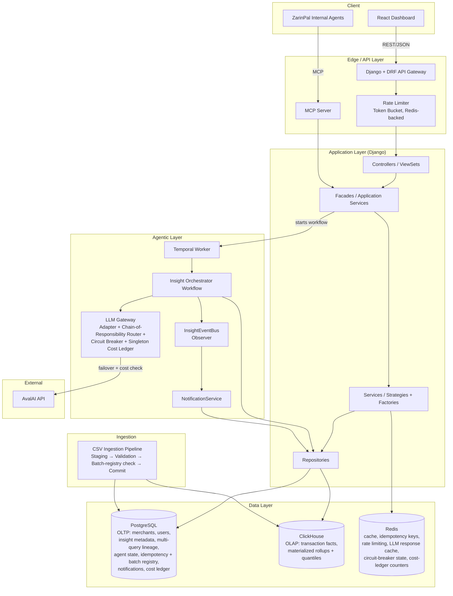

**Layering (strict and non-negotiable):**

- **Controller** (DRF `APIView` / `ViewSet`): HTTP concerns only — authentication, request validation, status codes, serialization.
- **Facade / Application Service**: one per bounded context (`AnalyticsFacade`, `AgentFacade`, `MerchantFacade`, `NotificationFacade`).
  This is the **single shared entry point** used by both REST controllers and the MCP server. It orchestrates services but contains no business rules.
- **Service / Strategy / Factory**: pure business logic. Each analysis type implements the `AnalysisStrategy` protocol and is produced by `AnalysisStrategyFactory` — controllers and facades never `if/elif` over analysis kind; the factory is the only place that maps a kind string to a class.
- **Repository**: data-access abstraction. Services never issue raw SQL or ClickHouse queries directly. **Only Repositories talk to databases.**

This layering guarantees that REST and MCP can never diverge in business logic and that sequence diagrams stay clean. Every diagram in §19 obeys it, including the newly added ones.

---

## 5. Data Layer

### 5.1 Why Two Databases (CQRS-flavored)

| Concern              | PostgreSQL                                      | ClickHouse                                              |
|-----------------------|----------------------------------------------------|-------------------------------------------------------------|
| Role                  | OLTP system-of-record                              | OLAP analytical store                                        |
| Holds                 | Merchants, users, auth, terminals, insight metadata, multi-query lineage, agent workflow state, idempotency ledger, batch registry, audit log, event calendar, notifications, cost ledger entries | Raw transaction facts, daily/monthly rollups, peer quantiles |
| Access pattern        | Low-latency point lookups, transactional writes    | High-throughput scans & aggregations over large volumes      |
| Consistency           | ACID                                                | Append-only, eventually merged (no application-level dedup needed — see §5.4) |

### 5.2 Identifier Rule (Critical Consistency Fix)

- External API and MCP endpoints accept **either** `merchant_key` (string, e.g. `M215`) **or** the internal UUID.
- All internal code, foreign keys, and AuthZ checks use the UUID.
- Controllers / MCP tool handlers resolve `merchant_key` → UUID exactly once at the edge and pass only the UUID thereafter.

### 5.3 PostgreSQL Schema (ER) — Complete

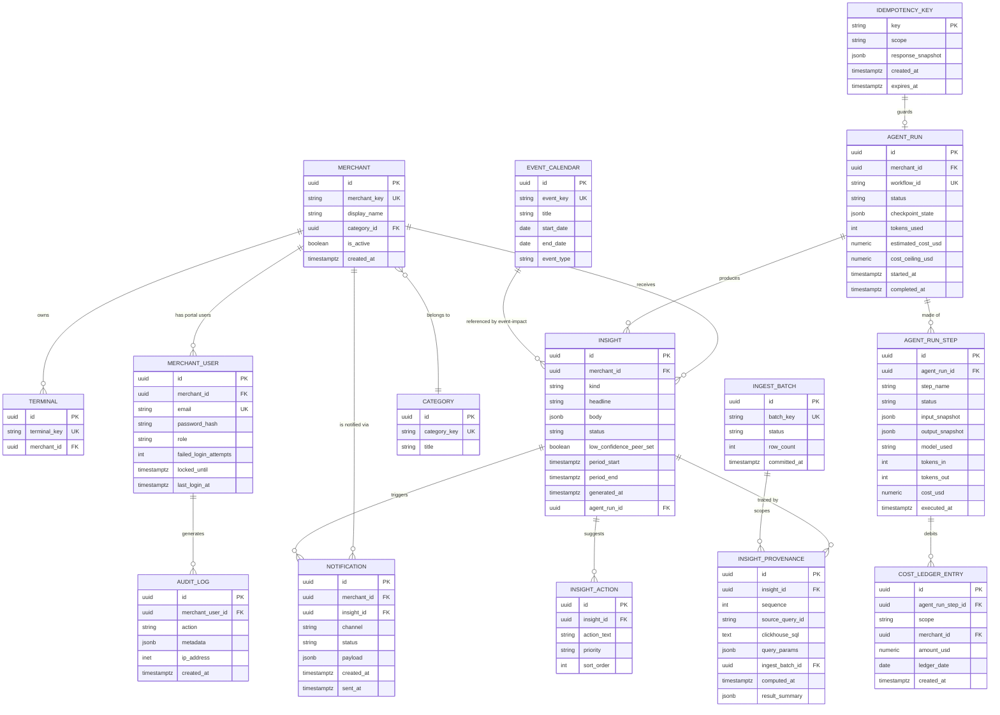

**Required indexes (PostgreSQL):**
- `MERCHANT(merchant_key)` unique
- `INGEST_BATCH(batch_key)` unique
- `AGENT_RUN(workflow_id)` unique
- `INSIGHT(merchant_id, period_start, period_end, kind)`
- `INSIGHT_PROVENANCE(insight_id, sequence)`
- `AUDIT_LOG(merchant_user_id, created_at)`
- `EVENT_CALENDAR(start_date, end_date)`
- `NOTIFICATION(merchant_id, status, created_at)`
- `COST_LEDGER_ENTRY(scope, merchant_id, ledger_date)` — supports the daily-sum queries the Singleton `CostLedger` issues on cold start / cache miss (see §9.3)
- `MERCHANT_USER(email)` unique, `MERCHANT_USER(locked_until)` partial index `WHERE locked_until IS NOT NULL`

### 5.4 ClickHouse Schema (Corrected — Idempotency at Pipeline Level)

```sql
-- Staging (transient)
CREATE TABLE tx_staging
(
    session_key          UInt64,
    try_seq              UInt16,
    terminal_key         String,
    merchant_key         String,
    category_id          String,
    category_title       String,
    amount               UInt64,
    adjusted_fee         UInt64,
    session_status       LowCardinality(String),
    try_status            LowCardinality(String),
    switch_response_code LowCardinality(String),
    psp_code              LowCardinality(String),
    issuer_bank_code      LowCardinality(String),
    payer_card_key       String,
    verify_type            LowCardinality(String),
    init_time_ms          Nullable(UInt32),
    verify_time_ms        Nullable(UInt32),
    created_at            DateTime,
    try_created_at        DateTime,
    verified_at            Nullable(DateTime),
    settled_at             Nullable(DateTime),
    expire_at               Nullable(DateTime),
    ingest_batch_id        UUID
)
ENGINE = MergeTree
ORDER BY (merchant_key, created_at, session_key, try_seq)
TTL created_at + INTERVAL 7 DAY;

-- Final fact table
CREATE TABLE tx_raw
(
    session_key          UInt64,
    try_seq              UInt16,
    terminal_key         String,
    merchant_key         String,
    category_id          String,
    category_title       String,
    amount               UInt64 CODEC(Delta, ZSTD(3)),
    adjusted_fee         UInt64 CODEC(Delta, ZSTD(3)),
    session_status       LowCardinality(String),
    try_status            LowCardinality(String),
    switch_response_code LowCardinality(String),
    psp_code              LowCardinality(String),
    issuer_bank_code      LowCardinality(String),
    payer_card_key       String,
    verify_type            LowCardinality(String),
    init_time_ms          Nullable(UInt32),
    verify_time_ms        Nullable(UInt32),
    created_at            DateTime CODEC(Delta, ZSTD(3)),
    try_created_at        DateTime,
    verified_at            Nullable(DateTime),
    settled_at             Nullable(DateTime),
    expire_at               Nullable(DateTime),
    ingest_batch_id        UUID
)
ENGINE = MergeTree
PARTITION BY toYYYYMM(created_at)
ORDER BY (merchant_key, created_at, session_key, try_seq);

-- Daily merchant rollup
CREATE MATERIALIZED VIEW tx_daily_rollup
ENGINE = AggregatingMergeTree
PARTITION BY toYYYYMM(day)
ORDER BY (merchant_key, day)
AS
SELECT
    merchant_key,
    toDate(created_at) AS day,
    uniqExactState(session_key)                                          AS sessions_started_state,
    uniqExactIfState(session_key, session_status IN ('Verified','Paid')) AS sessions_succeeded_state,
    sumIfState(amount, session_status IN ('Verified','Paid'))            AS gross_volume_state,
    sumIfState(adjusted_fee, session_status IN ('Verified','Paid'))      AS gross_fee_proxy_state,
    avgIfState(try_seq, session_status IN ('Verified','Paid'))           AS avg_try_seq_on_success_state,
    countIfState(try_status = 'NoAttempt')                               AS abandoned_before_attempt_state,
    quantileTimingState(0.5)(init_time_ms)                               AS p50_init_ms_state,
    quantileTimingState(0.95)(init_time_ms)                              AS p95_init_ms_state
FROM tx_raw
GROUP BY merchant_key, day;

-- Peer / category daily rollup
CREATE MATERIALIZED VIEW category_daily_rollup
ENGINE = AggregatingMergeTree
PARTITION BY toYYYYMM(day)
ORDER BY (category_id, day)
AS
SELECT
    category_id,
    toDate(created_at) AS day,
    uniqExactState(merchant_key)                                         AS active_merchants_state,
    uniqExactState(session_key)                                          AS category_sessions_state,
    sumIfState(amount, session_status IN ('Verified','Paid'))            AS category_gross_volume_state,
    avgIfState(amount, session_status IN ('Verified','Paid'))            AS category_avg_ticket_state,
    quantileState(0.5)(amount)                                           AS category_median_ticket_state,
    quantileState(0.9)(amount)                                           AS category_p90_ticket_state,
    quantileState(0.95)(amount)                                          AS category_p95_ticket_state
FROM tx_raw
GROUP BY category_id, day;

-- Terminal-level rolling window helper for anomaly detection (materialized incrementally,
-- read by AnomalyDetectionAnalysisStrategy — see §7.6)
CREATE MATERIALIZED VIEW terminal_noattempt_clusters
ENGINE = AggregatingMergeTree
PARTITION BY toYYYYMM(bucket_start)
ORDER BY (terminal_key, bucket_start)
AS
SELECT
    terminal_key,
    merchant_key,
    toStartOfInterval(created_at, INTERVAL 30 MINUTE) AS bucket_start,
    round(amount, -4)                                  AS amount_bucket,
    countState()                                        AS cluster_size_state,
    minState(created_at)                                AS first_seen_state,
    maxState(created_at)                                AS last_seen_state
FROM tx_raw
WHERE try_status = 'NoAttempt'
GROUP BY terminal_key, merchant_key, bucket_start, amount_bucket;
```

**Ingestion Pipeline (Idempotent by Registry):**

1. Compute `batch_key = sha256(file_content)`.
2. Attempt `INSERT INTO INGEST_BATCH (batch_key, status='staging')`. Unique constraint is the single gate — duplicate file is rejected before any ClickHouse write.
3. Load into `tx_staging` with the new `ingest_batch_id` (UUID).
4. Validate schema + status-conditional nulls.
5. On success: `INSERT INTO tx_raw SELECT ... FROM tx_staging WHERE ingest_batch_id = :id`, mark `status = 'committed'`.
   On failure: mark `status = 'failed'`, leave `tx_raw` untouched; staging TTL cleans up.
6. Every `INSIGHT_PROVENANCE` points to this exact `INGEST_BATCH.id`.

**Reading Aggregated State (mandatory pattern):**

```sql
SELECT
    merchant_key,
    sum(day_sessions) AS sessions_started,
    sum(day_succeeded) AS sessions_succeeded,
    sum(day_gross_volume) AS gross_volume
FROM (
    SELECT
        merchant_key,
        day,
        uniqExactMerge(sessions_started_state) AS day_sessions,
        uniqExactIfMerge(sessions_succeeded_state) AS day_succeeded,
        sumMerge(gross_volume_state) AS day_gross_volume
    FROM tx_daily_rollup
    WHERE merchant_key = {merchant_key:String}
      AND day BETWEEN {start:Date} AND {end:Date}
    GROUP BY merchant_key, day
)
GROUP BY merchant_key;
```

Every `TransactionRepository` method **must** use this `-Merge` pattern. Automated tests in §16 assert it.

### 5.5 Data Retention

- Hot data in ClickHouse: 24 months.
- After 24 months: move partitions to cold storage (S3 / object storage) via ClickHouse TTL + move-to-disk.
- PostgreSQL insight/provenance/notification/cost-ledger records kept indefinitely (small volume).
- Staging partitions auto-expire after 7 days.

---

## 6. Design Patterns Catalog

| Pattern                              | Where (class)                                       | Where (sequence diagram) | Why |
|----------------------------------------|-----------------------------------------------------------|--------------------------------|-----|
| Controller → Facade → Service/Strategy → Repository | Whole backend                                  | All of §19                | Strict separation; shared logic between REST & MCP |
| Strategy                             | `AnalysisStrategy` (5 concrete implementations), `LLMProviderStrategy` | 19.7–19.11, 19.16, 19.17 | Open for extension, one class per analysis kind |
| Factory                              | `AnalysisStrategyFactory`, `LLMProviderStrategyFactory` (aka the Chain builder) | 19.7–19.11, 19.16 | Callers never branch on `kind`; adding a new analysis type never touches the Facade |
| Repository                           | Transaction, Insight, AgentRun, IngestBatch, Notification, CostLedger | All of §19 | Only place that talks to DB/Redis/ClickHouse |
| Adapter                              | `AvalAIAdapter` implementing `LLMProviderAdapter`     | 19.16, 19.17              | Swappable provider without touching orchestration code |
| Chain of Responsibility               | `ModelRouterChain` (Cheap → Mid → Premium handlers)   | 19.17                      | Cost-first failover, each handler decides "can I serve this?" before passing on |
| Circuit Breaker                      | `LLMCircuitBreaker` (per model tier), `ClickHouseCircuitBreaker` (heavy-query executor) | 19.12, 19.17 | Fail fast, stop hammering a degraded dependency, recover via half-open probe |
| Bulkhead                             | Separate Temporal task queues (`analysis-queue`, `agent-queue`, `notification-queue`) | 19.16, 19.19 | Isolation — a stuck notification worker cannot starve agent workflows |
| Saga / Workflow (Temporal)           | `InsightGenerationWorkflow`                            | 19.16, 19.19               | Resumable multi-step, survives worker crash |
| CQRS (flavored)                      | Postgres vs ClickHouse                                 | 19.4, 19.7–19.11           | Access-pattern match |
| Value Object                         | `FeeProxyValue`, `Money`                               | n/a (type-level)           | Type-level fee protection |
| Idempotency Key / Registry           | `INGEST_BATCH`, `IDEMPOTENCY_KEY`                       | 19.13, 19.15, 19.20        | Safe retries |
| Observer                             | `InsightEventBus` → `NotificationService`, `CacheInvalidationListener` | 19.18                | Decouples insight persistence from downstream side effects |
| Singleton                            | `CostLedger` (per-process, Redis-synchronized)          | 19.16, 19.24                | One authoritative in-process view of spend, never re-instantiated mid-workflow |
| Cache-Aside                          | Redis (dashboard summary, LLM response cache)           | 19.4, 19.7                 | Performance + cost |
| Token Bucket                         | `RateLimiter` middleware                                | 19.22                       | Per-merchant / per-API-key fairness |

### 6.1 FeeProxyValue Guardrail

```python
from dataclasses import dataclass
from typing import Sequence

@dataclass(frozen=True)
class FeeProxyValue:
    """Deliberately has NO .as_currency() / .to_rial() method."""
    _raw: int

    def rank_within(self, peers: Sequence["FeeProxyValue"]) -> float: ...
    def share_of_revenue(self, gross: "Money") -> float: ...
    def trend_vs(self, other: "FeeProxyValue") -> float: ...
```

### 6.2 AnalysisStrategyFactory

```python
from typing import Protocol, Dict, Type

class AnalysisStrategy(Protocol):
    def compute(self, merchant_id: "UUID", params: "AnalysisParams") -> "AnalysisResult": ...
    def required_provenance(self) -> list["ProvenanceSpec"]: ...

class AnalysisStrategyFactory:
    """
    Single point of truth mapping an analysis 'kind' string to a Strategy class.
    Controllers/Facades call factory.create(kind) and never import a concrete
    Strategy class directly. Adding AnalysisKind.SEASONALITY = 6th strategy
    means: implement the class, register it here, done — Facade unchanged.
    """
    _registry: Dict[str, Type[AnalysisStrategy]] = {
        "time_range": "TimeRangeAnalysisStrategy",
        "event_impact": "EventImpactAnalysisStrategy",
        "cohort_retention": "CohortRetentionAnalysisStrategy",
        "peer_comparison": "PeerComparisonAnalysisStrategy",
        "anomaly_detection": "AnomalyDetectionAnalysisStrategy",
    }

    def create(self, kind: str) -> AnalysisStrategy: ...
```

### 6.3 LLM Provider Chain of Responsibility + Adapter

```python
from typing import Optional

class LLMProviderAdapter(Protocol):
    """Normalizes AvalAI's (or any future provider's) request/response shape
    into the orchestrator's internal DraftRequest / DraftResponse contract."""
    def complete(self, request: "DraftRequest") -> "DraftResponse": ...

class ModelTierHandler:
    """One link in the Chain of Responsibility. Each tier decides locally
    whether it is allowed to serve (circuit closed/half-open AND under its
    own cost sub-ceiling) before either serving or delegating to `next_`."""
    def __init__(self, tier: str, adapter: LLMProviderAdapter,
                 breaker: "LLMCircuitBreaker", next_: Optional["ModelTierHandler"]):
        self.tier, self.adapter, self.breaker, self.next_ = tier, adapter, breaker, next_

    def handle(self, request: "DraftRequest", ledger: "CostLedger") -> "DraftResponse":
        if self.breaker.allow_request() and ledger.can_afford(self.tier, request.estimated_tokens):
            try:
                response = self.adapter.complete(request)
                self.breaker.record_success()
                ledger.debit(self.tier, response.tokens_in, response.tokens_out)
                return response
            except ProviderError:
                self.breaker.record_failure()
        if self.next_ is None:
            raise AllProvidersExhausted()
        return self.next_.handle(request, ledger)

# Wiring order = cost-ascending: cheap -> mid -> premium
chain = ModelTierHandler("cheap", cheap_adapter, cheap_breaker,
            ModelTierHandler("mid", mid_adapter, mid_breaker,
                ModelTierHandler("premium", premium_adapter, premium_breaker, None)))
```

### 6.4 InsightEventBus (Observer)

```python
class InsightPublishedEvent:
    def __init__(self, insight_id: "UUID", merchant_id: "UUID", kind: str, severity: str): ...

class InsightEventBus:
    """In-process pub/sub. Facade/Orchestrator only knows about publish();
    it has zero knowledge of who is listening (Notification, cache
    invalidation, future webhook dispatch, etc.)."""
    def subscribe(self, handler: "Callable[[InsightPublishedEvent], None]") -> None: ...
    def publish(self, event: InsightPublishedEvent) -> None: ...
```

### 6.5 CostLedger (Singleton)

```python
class CostLedger:
    """Process-wide singleton. Backed by Redis INCRBYFLOAT counters keyed by
    (scope, merchant_id|GLOBAL, date) so multiple Temporal worker processes
    share one authoritative view of spend without a distributed lock on the
    hot path. Every debit is also durably logged to COST_LEDGER_ENTRY for
    audit, asynchronously, so the hot path never blocks on Postgres."""
    _instance: "CostLedger | None" = None

    @classmethod
    def instance(cls) -> "CostLedger":
        if cls._instance is None:
            cls._instance = cls()
        return cls._instance

    def can_afford(self, tier: str, estimated_tokens: int) -> bool: ...
    def debit(self, tier: str, tokens_in: int, tokens_out: int) -> None: ...
    def remaining_merchant_budget(self, merchant_id: "UUID") -> "Money": ...
    def remaining_global_budget(self) -> "Money": ...
```

---

## 7. Analytics Engine (Classical Layer)

### 7.1 Strategy Interface

```python
class AnalysisStrategy(Protocol):
    def compute(self, merchant_id: UUID, params: AnalysisParams) -> AnalysisResult: ...
    def required_provenance(self) -> list[ProvenanceSpec]: ...
```

**Implementations, produced exclusively via `AnalysisStrategyFactory` (§6.2):**
- `TimeRangeAnalysisStrategy`
- `EventImpactAnalysisStrategy` (difference-in-differences, uses `EVENT_CALENDAR`)
- `CohortRetentionAnalysisStrategy` (segmented by `verify_type`)
- `PeerComparisonAnalysisStrategy` (quantiles + volume decile, §2.3)
- `AnomalyDetectionAnalysisStrategy` (high-amount `NoAttempt` clusters, §2.4)

### 7.2 Segmentation & Confounder Control

- Retention segmented by `verify_type`.
- Peer comparison controlled by `category_id` **and** volume decile, with the small-bucket fallback from §2.3.
- Event-impact uses difference-in-differences against matched non-event windows of the same weekday-of-month.

### 7.3 Read Path

1. Redis cache
2. ClickHouse rollups (always via `-Merge` pattern)
3. `tx_raw` only for drill-down / provenance

If step 2 or 3 is unavailable, the `ClickHouseCircuitBreaker` intervenes — see §10.3 and §19.12.

### 7.4 EventImpactAnalysisStrategy — Algorithm Detail

1. Resolve the event window from `EVENT_CALENDAR` (e.g. Nowruz, Black Friday-equivalent campaigns).
2. Select a **matched control window**: the same weekday-of-month, same length, drawn from the nearest prior period that does not itself overlap any `EVENT_CALENDAR` entry (search backward up to 8 weeks; if none found, fall back to the same period one year prior and flag `control_window_quality: "yearly_fallback"`).
3. Compute `Δ = (merchant_metric_in_event_window − merchant_metric_in_control_window) − (category_metric_in_event_window − category_metric_in_control_window)` — the standard diff-in-diff estimator, isolating the merchant-specific lift from the category-wide seasonal effect.
4. Provenance records both the event window query and the control window query as separate `INSIGHT_PROVENANCE` rows (`sequence = 1, 2`), so the UI's "View query" can show both halves of the comparison.

### 7.5 CohortRetentionAnalysisStrategy — Algorithm Detail

1. Define a cohort as all distinct `payer_card_key` values with a successful (`Verified`/`Paid`) session in the cohort period, segmented by `verify_type` (per §7.2, since retention behavior differs meaningfully between OTP-based and non-OTP verification flows).
2. For each subsequent period bucket (week or month, per `params.granularity`), compute the fraction of the original cohort with at least one more successful session.
3. Output is a retention curve (`AnalysisResult.series`), never a single scalar, because a single "retention rate" number without the curve shape would understate analytical depth.

### 7.6 AnomalyDetectionAnalysisStrategy — Algorithm Detail

Reads directly from the `terminal_noattempt_clusters` materialized view (§5.4) rather than scanning `tx_raw`, keeping the strategy cheap enough to run on every dashboard load, not just on-demand.

1. `-Merge` the rolling 30-minute buckets for the merchant's terminals over the requested period.
2. Apply the clustering + severity heuristic from §2.4.
3. Any candidate scoring above `0.4` is returned as an `AnalysisResult` of `kind = "anomaly_detection"`; the Strategy itself does not push notifications — see §9.5.

### 7.7 PeerComparisonAnalysisStrategy — Algorithm Detail

See the full algorithm in §2.3. The Strategy's `required_provenance()` always returns two `ProvenanceSpec` entries: the merchant's own rollup query and the category/decile rollup query, so a merchant can audit exactly which peer set they were measured against.

---

## 8. Traceability & Provenance

Every `INSIGHT` carries one or more `INSIGHT_PROVENANCE` records linked to an exact `INGEST_BATCH.id`.

UI shows plain-language explanation by default; "View query" is optional.

Agentic insights additionally record model + tool calls per `AGENT_RUN_STEP`, and — new in this revision — every LLM cost debit is separately traceable via `COST_LEDGER_ENTRY(agent_run_step_id)`, so a merchant-facing cost dispute or an internal cost audit can reconstruct exactly which model tier produced which draft at which price, down to the individual Chain-of-Responsibility hop (§6.3, §19.17).

---

## 9. Agentic Layer

### 9.1 Why Temporal

Durable state, exact resume-from-last-completed-step, automatic retry with backoff, workflow history. See §19.19 for the explicit crash-resume sequence, which was previously only asserted in prose (§3) but not demonstrated at the sequence-diagram level.

### 9.2 Insight Generation Workflow

**Activity configuration (concrete):**
- `FetchMetrics`, `SegmentData`, `DetectCandidateInsights`, `RankByNovelty`:
  timeout 30 s, heartbeat 10 s, max attempts 3, non-retryable on permanent data errors.
- `DraftNarrative`, `ValidateAgainstData`:
  timeout 60 s, max attempts 5, exponential backoff, cost-ceiling checked against the `CostLedger` Singleton (§6.5) before each call.
- `Publish`: timeout 15 s, max attempts 3. On success, publishes an `InsightPublishedEvent` to the `InsightEventBus` (§6.4) as its final act, so notification delivery cannot happen before the insight is durably committed.

**Workflow ID:** `{merchant_id}:{period}:{kind}` (deterministic).

**Task queues (Bulkhead, §6):** `analysis-queue` (classical strategies, synchronous request path), `agent-queue` (Temporal activities for `InsightGenerationWorkflow`), `notification-queue` (Observer-triggered delivery). A backlog or crash in one queue cannot block the others.

### 9.3 LLM Gateway — Internals (Adapter + Chain of Responsibility + Circuit Breaker + Singleton)

The LLM Gateway is not a single opaque box; it is composed of four cooperating patterns, all shown explicitly in §19.16 and §19.17:

1. **Adapter (`AvalAIAdapter`)** — translates the orchestrator's provider-agnostic `DraftRequest`/`DraftResponse` into AvalAI's actual wire format. Swapping AvalAI for a second provider means writing one new Adapter class; nothing else changes.
2. **Chain of Responsibility (`ModelRouterChain`)** — cheap → mid → premium `ModelTierHandler` links (§6.3). Each handler independently checks its own `LLMCircuitBreaker` and consults the `CostLedger` before attempting a call, then either serves the request or passes it down the chain.
3. **Circuit Breaker (`LLMCircuitBreaker`, one instance per tier)** — closed → open → half-open state machine, Redis-backed so all Temporal workers observe the same breaker state. Threshold: 5 consecutive failures within 60 s trips the breaker to `open` for a 30 s cooldown, after which a single half-open probe request is allowed through.
4. **Singleton (`CostLedger`)** — the single authoritative in-process view of spend (§6.5), consulted by every tier handler before it is allowed to spend, and updated atomically after every successful call.

Additional gateway-level policies:
- Hard cost ceilings (per-merchant daily/monthly + global daily), enforced by `CostLedger.can_afford`.
- Response cache key includes `ingest_batch_id`, so a re-run against unchanged data is a guaranteed cache hit regardless of which tier last served it.
- Forced structured JSON output for grounding, validated by `ValidateAgainstData` before publish.

### 9.4 MCP Server

Shares the exact same Facade. Tools are merchant-scoped by construction. Auth via mTLS or signed API keys. See §19.20 (write tool) and §19.21 (read tool) for both flavors of MCP interaction.

### 9.5 Notification Pipeline (Observer)

`InsightGenerationWorkflow.Publish` and the synchronous `AnomalyDetectionAnalysisStrategy` path both terminate by publishing an `InsightPublishedEvent` to `InsightEventBus`. `NotificationService` is a registered subscriber (§6.4) that:
1. Applies per-merchant notification preferences (channel, severity threshold) — read from `MERCHANT` settings, not hardcoded.
2. Writes a `NOTIFICATION` row with `status = 'pending'`.
3. Enqueues delivery onto the `notification-queue` (Bulkhead-isolated from agent/analysis work).
4. A separate delivery worker marks `status = 'sent'` or `'failed'` after attempting the channel send (SMS/email/in-app — channel adapters follow the same Adapter pattern as §9.3, not detailed further here as it is out of MVP scope beyond in-app + email).

This decoupling means a slow or failing notification channel can never delay insight publication, and a new notification channel can be added by registering a new subscriber without touching the orchestrator.

---

## 10. Resilience, Scalability & Idempotency

### 10.1 Load Handling
ClickHouse rollups, Postgres read replicas, Redis, bulkheaded Temporal queues, horizontal scaling of stateless services.

### 10.2 Idempotency

| Boundary               | Mechanism                                       |
|--------------------------|---------------------------------------------------|
| CSV ingestion            | `INGEST_BATCH.batch_key` unique (Postgres)        |
| Agent trigger             | `IDEMPOTENCY_KEY`                                  |
| Temporal workflow         | Deterministic workflow ID                          |
| External side-effects     | Temporal Activity + idempotency_key                |
| Notification delivery     | `NOTIFICATION.id` used as the channel-provider's own idempotency key, preventing duplicate SMS/email on delivery-worker retry |

### 10.3 Circuit Breaker & Bulkhead

**`ClickHouseCircuitBreaker`** wraps any query classified as "heavy" (a full `tx_raw` scan, not a rollup read). Threshold: 3 consecutive timeouts (> 5 s) within 60 s trips the breaker open for 20 s. While open, the Repository falls back to the **last successfully cached rollup-derived summary** in Redis (even if slightly stale) rather than propagating a 500 to the user — see §19.12. The UI renders a small "showing cached data" badge in this state, satisfying the non-technical-UX requirement even during degradation.

**`LLMCircuitBreaker`** — per model tier, described in §9.3.

**Bulkhead** — separate Temporal task queues per §9.2, and a separate Postgres connection pool per service class (`api`, `mcp-server`, `temporal-worker`) so a connection-pool exhaustion event in one process class cannot starve another.

---

## 11. API Contract

All endpoints accept `merchant_ref` (key or UUID). Controller resolves once. All endpoints pass through the Token Bucket rate limiter (§13, §19.22) before reaching the Controller.

```
GET  /api/v1/merchants/{merchant_ref}/dashboard/summary
GET  /api/v1/merchants/{merchant_ref}/insights?...
GET  /api/v1/merchants/{merchant_ref}/insights/{insight_id}
GET  /api/v1/merchants/{merchant_ref}/insights/{insight_id}/provenance
POST /api/v1/merchants/{merchant_ref}/analysis/time-range
POST /api/v1/merchants/{merchant_ref}/analysis/event-impact
POST /api/v1/merchants/{merchant_ref}/analysis/peer-comparison
POST /api/v1/merchants/{merchant_ref}/analysis/cohort-retention
POST /api/v1/merchants/{merchant_ref}/analysis/anomaly-detection
POST /api/v1/merchants/{merchant_ref}/agent/trigger-summary   # Idempotency-Key required
GET  /api/v1/merchants/{merchant_ref}/agent/runs/{run_id}
GET  /api/v1/merchants/{merchant_ref}/agent/runs/{run_id}/cost
GET  /api/v1/merchants/{merchant_ref}/notifications?status=&page=
POST /api/v1/merchants/{merchant_ref}/notifications/{notification_id}/mark-read
POST /api/v1/auth/login
POST /api/v1/auth/refresh
POST /api/v1/auth/logout
```

**Frontend agent-run updates:** short-polling (2–3 s) on the poll_url while status is `running`. SSE/WebSocket is a future optional enhancement; not required for v1.

**Rate limit response contract:** `429 Too Many Requests` with a `Retry-After` header; body includes `{ "error": "RATE_LIMITED", "retry_after_seconds": N }`. See §19.22.

**Degraded-data response contract:** when the `ClickHouseCircuitBreaker` is open and a cached fallback is served, responses include `"data_freshness": "cached_fallback"` alongside the normal payload, rather than a distinct status code, so existing clients degrade gracefully without special-casing.

---

## 12. Non-Technical UX

- Headline-first cards.
- Charts collapsed behind "See the data".
- Provenance secondary.
- Agentic digests: 3–5 sentences + action list.
- In-app notification bell surfaces `NOTIFICATION` rows (§9.5); severity determines badge color, not raw anomaly score, so merchants never have to interpret a number to know whether something needs attention.
- Degraded-data badge (§11) is a single small pill, never a blocking banner or modal — the platform must never look "broken" to a non-technical merchant simply because ClickHouse is under load.

---

## 13. Security

- JWT (access + refresh) for portal; mTLS / signed keys for MCP & workers.
- Object-level AuthZ on every Facade method.
- Merchant-scoped queries by construction inside Repositories.
- Secrets in secret store.
- PII masked; access audit-logged.
- Schema validation on all inputs.
- **Rate limiting — Token Bucket, explicit algorithm:** each `(api_key_or_merchant_user_id)` gets a Redis-backed bucket of capacity 60 tokens, refilled at 1 token/second. Each request consumes 1 token; `POST /agent/trigger-summary` consumes 5 tokens (reflecting its downstream cost). A request with an empty bucket is rejected with `429` before it reaches the Controller (§19.22) — this is enforced at the Edge Layer, not inside the Facade, so rate-limited requests never touch business logic or the database.
- Account lockout: `MERCHANT_USER.failed_login_attempts` — 5 consecutive failures locks the account for 15 minutes (`locked_until`), mirrored in the enhanced login sequence (§19.1).
- Audit log for every portal action.
- CORS: only the production frontend origin.
- CSRF: double-submit cookie for browser clients; not required for pure API/MCP clients.
- Ingestion: strict schema validation, reject malformed rows.

---

## 14. Deployment (Docker Compose)

```yaml
services:
  api:
  mcp-server:
  temporal-worker:
  notification-worker:
  frontend:
  postgres:
  clickhouse:
  redis:
  temporal:
  ingestion:
```

Shared Python package for api / mcp-server / temporal-worker / notification-worker.
`docker-compose.prod.yml` sets resource limits, restart policies, healthchecks, disables debug.

---

## 15. Observability & Operations

- OpenTelemetry traces, propagated across the Chain-of-Responsibility hops (§9.3) so a single trace shows exactly which model tier ultimately served a request.
- Prometheus metrics: latency, errors, tokens, cost, workflow success, query duration, **plus** `llm_circuit_breaker_state{tier}`, `clickhouse_circuit_breaker_state`, `rate_limiter_rejections_total`, `notification_delivery_latency_seconds`.
- Structured JSON logs with correlation IDs.
- Cost dashboard (ops UI + Prometheus), reading directly from `CostLedger` Redis counters for real-time figures and `COST_LEDGER_ENTRY` for historical audit.
- Alerts: cost ceiling, workflow failure rate, ingestion lag, replication lag, circuit breaker stuck open > 5 minutes, notification backlog depth.

---

## 16. Testing Strategy

| Layer                  | What is tested                                                | Tools |
|--------------------------|------------------------------------------------------------------|-------|
| Unit                    | Strategy, Factory registry completeness, FeeProxyValue, pure functions | pytest + fakes |
| Integration             | Repository ↔ CH/PG, Facade flows                                | pytest + testcontainers |
| Contract                | REST & MCP shapes                                                | schemathesis / pact |
| Grounding                | ValidateAgainstData rejects invented numbers                    | golden files |
| Ingestion idempotency    | Duplicate file rejected, rollups never double-count             | integration test |
| Pattern correctness      | Circuit Breaker trips/recovers on schedule; Chain of Responsibility falls through tiers in order; CostLedger Singleton never double-instantiated across workers; Observer delivers to all subscribers exactly once | dedicated unit + integration suite |
| Load                    | Dashboard + concurrent agent triggers + rate limiter under burst | k6 / Locust |
| Chaos                   | Activity failures, CH partial outage, Redis eviction, mid-workflow worker kill (crash-resume, §19.19) | custom scripts |
| End-to-end               | Full insight path + provenance + notification delivery          | Playwright + API |

---

## 17. Team Plan & Phasing

| Track                      | Owner            | Scope |
|-------------------------------|--------------------|-------|
| Data & Ingestion            | Pourya             | CH schema, INGEST_BATCH pipeline, staging → commit, anomaly rollup view |
| Core API & Agentic          | Mamad              | Django layering, Strategy/Factory, Temporal, LLM Gateway internals (Adapter/Chain/Breaker/Ledger), Observer/Notification, MCP, cost ceilings, rate limiter |
| Dashboard UX                | Ali                | React, headline cards, provenance UI, notification bell, degraded-data badge, cost/ops views |

**Phases:**
1. Foundation (ingestion + rollups + TimeRange + PeerComparison + provenance)
2. Classical completeness (EventImpact, CohortRetention, AnomalyDetection strategies + UX + AuthZ + rate limiter)
3. Agentic core (Temporal + LLM Gateway internals + grounding + ceilings + Observer/Notification pipeline)
4. MCP + Hardening (MCP, security, load, observability, circuit breakers, crash-resume validation, prod Compose)

---

## 18. Evaluation-Criteria Traceability Map

| Criterion                       | Where addressed |
|------------------------------------|--------------------|
| Actionability & novelty            | §12, §2.4, §7.1, §7.2, §7.6, §9.5 |
| Correctness & traceability         | §8, §9.2, §2.2, §5.4, §16 |
| Analytical depth                    | §7.2, §7.4, §7.5, §7.6, §7.7 |
| Non-technical UX                    | §12 |
| Technical quality & runnability     | §4, §6, §9.3, §10.3, §14, §15, §16, §19 |

---

## 19. Sequence Diagrams (Complete Set)

All diagrams obey the layering rules:
- UI talks **only** to Controller.
- Only Repositories talk to databases / Redis / ClickHouse.
- Every call has a return arrow.
- Every design pattern claimed in §6 appears as an explicit participant or explicit branch in at least one diagram below — not merely named in prose.
- Edge cases (idempotency hit, cost ceiling, validation failure, unknown merchant, circuit open, rate limited, worker crash, etc.) are modelled.

### 19.1 Merchant Login (with Lockout)

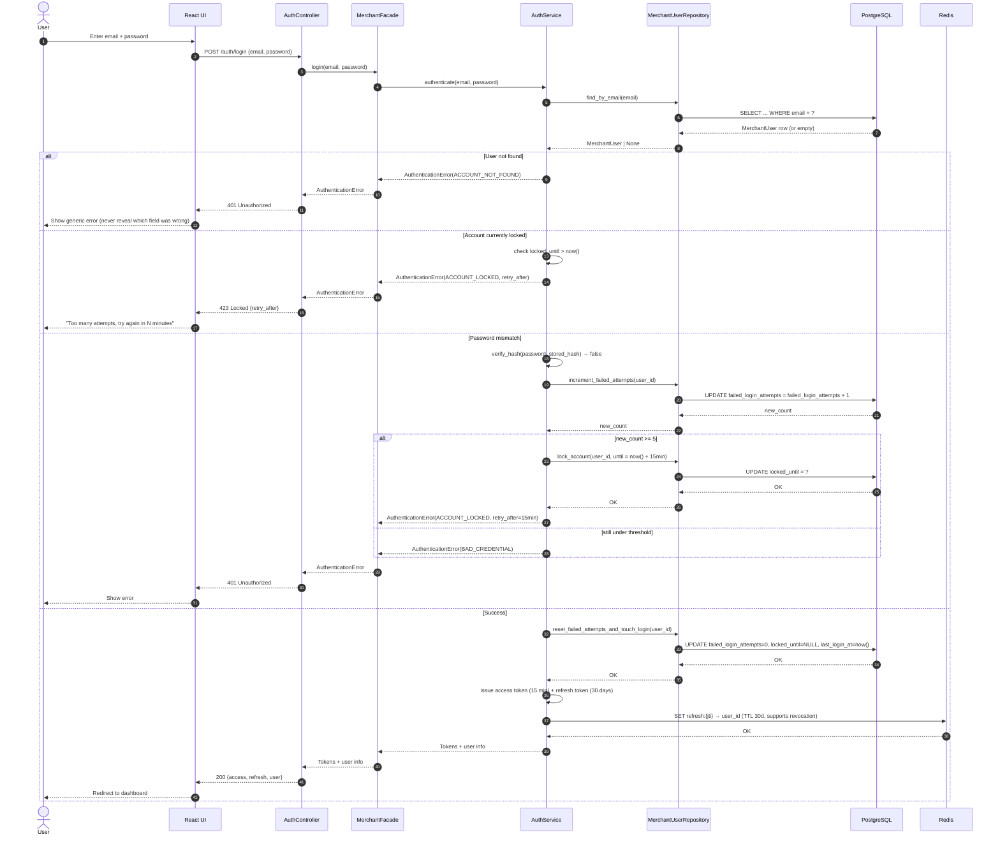

### 19.2 Refresh Access Token

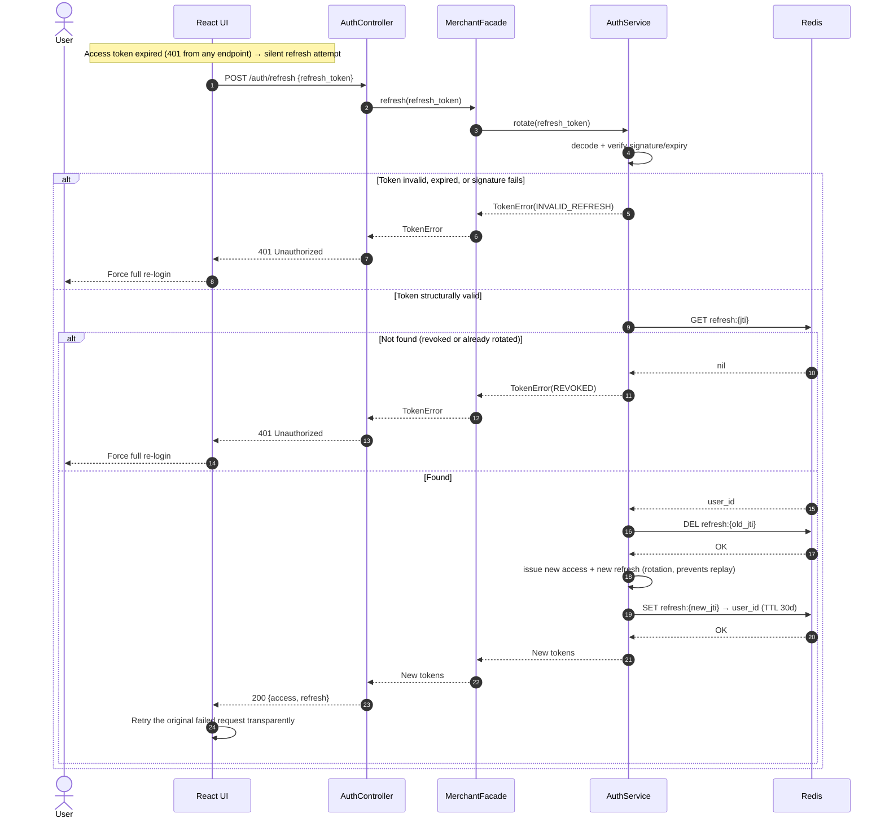

### 19.3 Logout

```mermaid
sequenceDiagram
    autonumber
    actor User
    participant UI as React UI
    participant Ctrl as AuthController
    participant Fac as MerchantFacade
    participant Svc as AuthService
    participant Redis as Redis

    User->>UI: Click "Log out"
    UI->>Ctrl: POST /auth/logout {refresh_token}
    Ctrl->>Fac: logout(refresh_token)
    Fac->>Svc: revoke(refresh_token)
    Svc->>Svc: decode jti (best-effort; malformed token is not an error here)
    Svc->>Redis: DEL refresh:{jti}
    Redis-->>Svc: OK (or 0 if already gone — both treated as success)
    Svc-->>Fac: Revoked
    Fac-->>Ctrl: Revoked
    Ctrl-->>UI: 204 No Content
    UI->>UI: Clear local tokens
    UI-->>User: Redirect to login page
```

### 19.4 Dashboard Summary Load (Circuit-Breaker Aware)

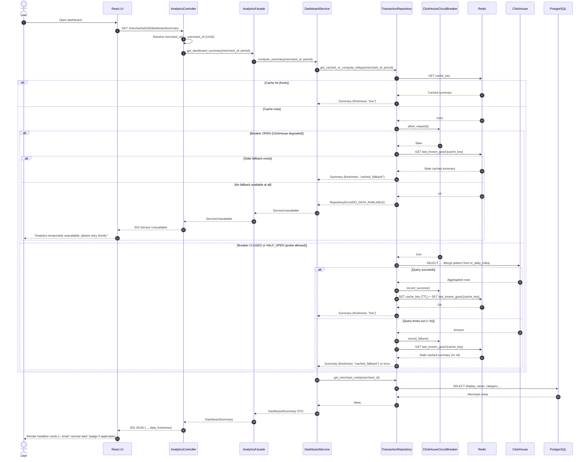

### 19.5 List Insights (with Pagination)

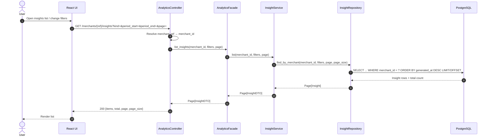

### 19.6 Get Single Insight + Provenance

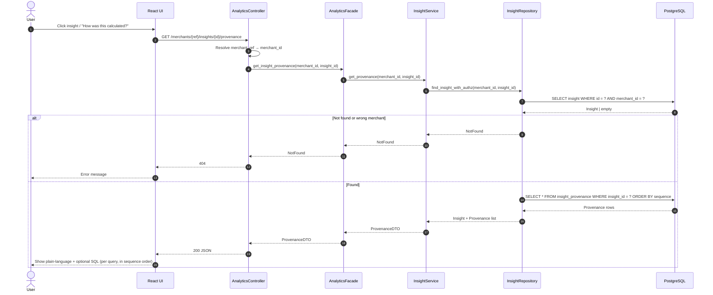

### 19.7 Trigger Classical Analysis — Time-Range (Factory Pattern Explicit)

```mermaid
sequenceDiagram
    autonumber
    actor User
    participant UI as React UI
    participant Ctrl as AnalyticsController
    participant Fac as AnalyticsFacade
    participant Svc as AnalysisService
    participant Factory as AnalysisStrategyFactory
    participant Strat as TimeRangeAnalysisStrategy
    participant Repo as TransactionRepository
    participant InsightRepo as InsightRepository
    participant CH as ClickHouse
    participant PG as PostgreSQL
    participant Redis as Redis

    User->>UI: Request time-range analysis
    UI->>Ctrl: POST /merchants/{ref}/analysis/time-range {period_start, period_end}
    Ctrl->>Ctrl: Resolve merchant_ref → merchant_id
    Ctrl->>Fac: run_analysis(kind="time_range", merchant_id, params)
    Fac->>Svc: execute(kind="time_range", merchant_id, params)
    Svc->>Factory: create("time_range")
    Note over Factory: Factory looks up the registry (§6.2) by kind string.<br/>Svc never imports TimeRangeAnalysisStrategy directly —<br/>adding a 6th analysis kind never touches this call site.
    Factory-->>Svc: TimeRangeAnalysisStrategy instance
    Svc->>Strat: compute(merchant_id, params)
    Strat->>Repo: fetch_metrics(merchant_id, params)
    Repo->>Redis: GET cache?
    alt Cache hit
        Redis-->>Repo: data
    else Miss
        Redis-->>Repo: miss
        Repo->>CH: -Merge query on tx_daily_rollup
        CH-->>Repo: rows
        Repo->>Redis: SET
        Redis-->>Repo: OK
    end
    Repo-->>Strat: Metrics
    Strat->>Strat: Build AnalysisResult + ProvenanceSpec list
    Strat-->>Svc: AnalysisResult
    Svc->>InsightRepo: save_insight_with_provenance(result)
    InsightRepo->>PG: BEGIN; INSERT insight; INSERT provenance rows; COMMIT
    PG-->>InsightRepo: OK
    InsightRepo-->>Svc: Insight id
    Svc-->>Fac: InsightDTO
    Fac-->>Ctrl: InsightDTO
    Ctrl-->>UI: 200 / 201 JSON
    UI-->>User: Show new insight card
```

### 19.8 Trigger Classical Analysis — Event Impact (Diff-in-Diff)

```mermaid
sequenceDiagram
    autonumber
    actor User
    participant UI as React UI
    participant Ctrl as AnalyticsController
    participant Fac as AnalyticsFacade
    participant Svc as AnalysisService
    participant Factory as AnalysisStrategyFactory
    participant Strat as EventImpactAnalysisStrategy
    participant EventRepo as EventCalendarRepository
    participant TxRepo as TransactionRepository
    participant InsightRepo as InsightRepository
    participant PG as PostgreSQL
    participant CH as ClickHouse

    User->>UI: Select a calendar event (e.g. "Nowruz Campaign") to analyze impact
    UI->>Ctrl: POST /merchants/{ref}/analysis/event-impact {event_key}
    Ctrl->>Ctrl: Resolve merchant_ref → merchant_id
    Ctrl->>Fac: run_analysis(kind="event_impact", merchant_id, {event_key})
    Fac->>Svc: execute(kind="event_impact", merchant_id, params)
    Svc->>Factory: create("event_impact")
    Factory-->>Svc: EventImpactAnalysisStrategy instance
    Svc->>Strat: compute(merchant_id, params)

    Strat->>EventRepo: find_event(event_key)
    EventRepo->>PG: SELECT * FROM event_calendar WHERE event_key = ?
    PG-->>EventRepo: EventCalendar row | empty
    alt Event not found
        EventRepo-->>Strat: NotFound
        Strat-->>Svc: AnalysisError(EVENT_NOT_FOUND)
        Svc-->>Fac: AnalysisError
        Fac-->>Ctrl: AnalysisError
        Ctrl-->>UI: 404
        UI-->>User: "Unknown event"
    else Event found
        EventRepo-->>Strat: EventCalendar{start_date, end_date}
        Strat->>Strat: resolve_matched_control_window(event window, search back up to 8 weeks)
        alt No clean control window found within 8 weeks
            Strat->>Strat: fallback to same period 1 year prior, flag "yearly_fallback"
        end
        Strat->>TxRepo: fetch_metrics(merchant_id, event_window)
        TxRepo->>CH: -Merge query on tx_daily_rollup (event window)
        CH-->>TxRepo: merchant_event_metrics
        TxRepo-->>Strat: merchant_event_metrics
        Strat->>TxRepo: fetch_metrics(merchant_id, control_window)
        TxRepo->>CH: -Merge query on tx_daily_rollup (control window)
        CH-->>TxRepo: merchant_control_metrics
        TxRepo-->>Strat: merchant_control_metrics
        Strat->>TxRepo: fetch_category_metrics(category_id, event_window)
        TxRepo->>CH: -Merge query on category_daily_rollup (event window)
        CH-->>TxRepo: category_event_metrics
        TxRepo-->>Strat: category_event_metrics
        Strat->>TxRepo: fetch_category_metrics(category_id, control_window)
        TxRepo->>CH: -Merge query on category_daily_rollup (control window)
        CH-->>TxRepo: category_control_metrics
        TxRepo-->>Strat: category_control_metrics
        Strat->>Strat: compute diff-in-diff Δ = (merchant_event - merchant_control) - (category_event - category_control)
        Strat->>Strat: Build AnalysisResult (2 ProvenanceSpec entries: event query, control query)
        Strat-->>Svc: AnalysisResult
        Svc->>InsightRepo: save_insight_with_provenance(result)
        InsightRepo->>PG: BEGIN; INSERT insight; INSERT 2 provenance rows; COMMIT
        PG-->>InsightRepo: OK
        InsightRepo-->>Svc: Insight id
        Svc-->>Fac: InsightDTO
        Fac-->>Ctrl: InsightDTO
        Ctrl-->>UI: 201 JSON
        UI-->>User: Show "Your lift vs category during {event}" card
    end
```

### 19.9 Trigger Classical Analysis — Peer Comparison (Volume Decile)

```mermaid
sequenceDiagram
    autonumber
    actor User
    participant UI as React UI
    participant Ctrl as AnalyticsController
    participant Fac as AnalyticsFacade
    participant Svc as AnalysisService
    participant Factory as AnalysisStrategyFactory
    participant Strat as PeerComparisonAnalysisStrategy
    participant TxRepo as TransactionRepository
    participant InsightRepo as InsightRepository
    participant CH as ClickHouse
    participant PG as PostgreSQL

    User->>UI: Request peer comparison for current period
    UI->>Ctrl: POST /merchants/{ref}/analysis/peer-comparison {period}
    Ctrl->>Ctrl: Resolve merchant_ref → merchant_id
    Ctrl->>Fac: run_analysis(kind="peer_comparison", merchant_id, params)
    Fac->>Svc: execute(kind="peer_comparison", merchant_id, params)
    Svc->>Factory: create("peer_comparison")
    Factory-->>Svc: PeerComparisonAnalysisStrategy instance
    Svc->>Strat: compute(merchant_id, params)

    Strat->>TxRepo: get_merchant_category_and_volume(merchant_id, period)
    TxRepo->>CH: -Merge query on tx_daily_rollup
    CH-->>TxRepo: merchant_volume, category_id
    TxRepo-->>Strat: merchant_volume, category_id

    Strat->>TxRepo: get_category_volume_deciles(category_id, period)
    TxRepo->>CH: -Merge + window-function decile query on category_daily_rollup
    CH-->>TxRepo: decile boundaries + merchant counts per decile
    TxRepo-->>Strat: decile_distribution

    Strat->>Strat: resolve_merchant_decile(merchant_volume, decile_distribution)
    alt Resolved decile bucket has < 8 merchants
        Strat->>Strat: widen to ±1 decile
        alt Still < 8 merchants after widening
            Strat->>Strat: widen to whole category, set low_confidence_peer_set=true
        end
    end

    Strat->>TxRepo: get_peer_quantiles(category_id, decile_or_widened_scope, period)
    TxRepo->>CH: -Merge query on category_daily_rollup (quantileMerge)
    CH-->>TxRepo: peer_quantiles {p50, p90, p95}
    TxRepo-->>Strat: peer_quantiles

    Strat->>Strat: compute merchant percentile position via quantileExact inverse lookup
    Strat->>Strat: Build AnalysisResult (2 ProvenanceSpec: own rollup query, category/decile rollup query)
    Strat-->>Svc: AnalysisResult
    Svc->>InsightRepo: save_insight_with_provenance(result)
    InsightRepo->>PG: BEGIN; INSERT insight (low_confidence_peer_set flag included); INSERT provenance rows; COMMIT
    PG-->>InsightRepo: OK
    InsightRepo-->>Svc: Insight id
    Svc-->>Fac: InsightDTO
    Fac-->>Ctrl: InsightDTO
    Ctrl-->>UI: 201 JSON
    UI-->>User: "You are in the top N% of your category" (+ muted disclaimer if low_confidence_peer_set)
```

### 19.10 Trigger Classical Analysis — Cohort Retention

```mermaid
sequenceDiagram
    autonumber
    actor User
    participant UI as React UI
    participant Ctrl as AnalyticsController
    participant Fac as AnalyticsFacade
    participant Svc as AnalysisService
    participant Factory as AnalysisStrategyFactory
    participant Strat as CohortRetentionAnalysisStrategy
    participant TxRepo as TransactionRepository
    participant InsightRepo as InsightRepository
    participant CH as ClickHouse
    participant PG as PostgreSQL

    User->>UI: Request cohort retention (granularity=week)
    UI->>Ctrl: POST /merchants/{ref}/analysis/cohort-retention {cohort_period, granularity}
    Ctrl->>Ctrl: Resolve merchant_ref → merchant_id
    Ctrl->>Fac: run_analysis(kind="cohort_retention", merchant_id, params)
    Fac->>Svc: execute(kind="cohort_retention", merchant_id, params)
    Svc->>Factory: create("cohort_retention")
    Factory-->>Svc: CohortRetentionAnalysisStrategy instance
    Svc->>Strat: compute(merchant_id, params)

    Strat->>TxRepo: get_cohort_payers(merchant_id, cohort_period, verify_type segments)
    TxRepo->>CH: SELECT DISTINCT payer_card_key, verify_type FROM tx_raw WHERE merchant_key=? AND created_at BETWEEN cohort_period AND session_status IN ('Verified','Paid')
    CH-->>TxRepo: cohort payer set (segmented by verify_type)
    TxRepo-->>Strat: cohort payer set

    loop for each subsequent period bucket (per granularity)
        Strat->>TxRepo: get_returning_payers(merchant_id, cohort_payer_set, bucket_window)
        TxRepo->>CH: SELECT DISTINCT payer_card_key FROM tx_raw WHERE merchant_key=? AND created_at BETWEEN bucket_window AND payer_card_key IN cohort_payer_set AND session_status IN ('Verified','Paid')
        CH-->>TxRepo: returning payers for this bucket
        TxRepo-->>Strat: returning payers for this bucket
        Strat->>Strat: retention_fraction = |returning| / |cohort|
    end

    Strat->>Strat: Build AnalysisResult.series (full retention curve, segmented by verify_type) + ProvenanceSpec per bucket query
    Strat-->>Svc: AnalysisResult
    Svc->>InsightRepo: save_insight_with_provenance(result)
    InsightRepo->>PG: BEGIN; INSERT insight; INSERT provenance rows (one per bucket); COMMIT
    PG-->>InsightRepo: OK
    InsightRepo-->>Svc: Insight id
    Svc-->>Fac: InsightDTO
    Fac-->>Ctrl: InsightDTO
    Ctrl-->>UI: 201 JSON
    UI-->>User: Render retention curve chart (collapsed behind "See the data" by default, per §12)
```

### 19.11 Trigger Classical Analysis — Anomaly Detection (with Observer Hand-off)

```mermaid
sequenceDiagram
    autonumber
    actor User
    participant UI as React UI
    participant Ctrl as AnalyticsController
    participant Fac as AnalyticsFacade
    participant Svc as AnalysisService
    participant Factory as AnalysisStrategyFactory
    participant Strat as AnomalyDetectionAnalysisStrategy
    participant TxRepo as TransactionRepository
    participant InsightRepo as InsightRepository
    participant Bus as InsightEventBus
    participant CH as ClickHouse
    participant PG as PostgreSQL

    User->>UI: Open dashboard (anomaly scan runs automatically on load, per §7.6)
    UI->>Ctrl: POST /merchants/{ref}/analysis/anomaly-detection {period}
    Ctrl->>Ctrl: Resolve merchant_ref → merchant_id
    Ctrl->>Fac: run_analysis(kind="anomaly_detection", merchant_id, params)
    Fac->>Svc: execute(kind="anomaly_detection", merchant_id, params)
    Svc->>Factory: create("anomaly_detection")
    Factory-->>Svc: AnomalyDetectionAnalysisStrategy instance
    Svc->>Strat: compute(merchant_id, params)

    Strat->>TxRepo: get_noattempt_clusters(merchant_id, period)
    TxRepo->>CH: -Merge query on terminal_noattempt_clusters
    CH-->>TxRepo: cluster rows {terminal_key, bucket_start, amount_bucket, cluster_size}
    TxRepo-->>Strat: cluster rows

    Strat->>Strat: apply severity heuristic (§2.4): score = min(1.0, cluster_size/10) + recency boost
    Strat->>Strat: filter candidates with score > 0.4

    alt No candidate clears the threshold
        Strat-->>Svc: AnalysisResult(empty, kind="anomaly_detection")
        Svc-->>Fac: InsightDTO(empty)
        Fac-->>Ctrl: InsightDTO(empty)
        Ctrl-->>UI: 200 {candidates: []}
        UI-->>User: No badge shown (nothing to flag)
    else One or more candidates found
        Strat->>Strat: Build AnalysisResult with candidate list + ProvenanceSpec
        Strat-->>Svc: AnalysisResult
        Svc->>InsightRepo: save_insight_with_provenance(result)
        InsightRepo->>PG: BEGIN; INSERT insight (kind='anomaly_detection'); INSERT provenance; COMMIT
        PG-->>InsightRepo: OK
        InsightRepo-->>Svc: Insight id
        Note over Svc,Bus: Strategy itself never decides to notify (§2.4) —<br/>Service publishes the event; NotificationService (a Bus subscriber)<br/>owns the decision of channel/severity threshold (§9.5)
        Svc->>Bus: publish(InsightPublishedEvent(insight_id, merchant_id, kind="anomaly_detection", severity=score))
        Bus-->>Svc: ack (fire-and-forget to subscribers, see §19.18 for the subscriber side)
        Svc-->>Fac: InsightDTO
        Fac-->>Ctrl: InsightDTO
        Ctrl-->>UI: 201 {candidates: [...]}
        UI-->>User: Show "possible checkout friction detected" card
    end
```

### 19.12 Circuit Breaker Trip on Heavy ClickHouse Query (Standalone Detail)

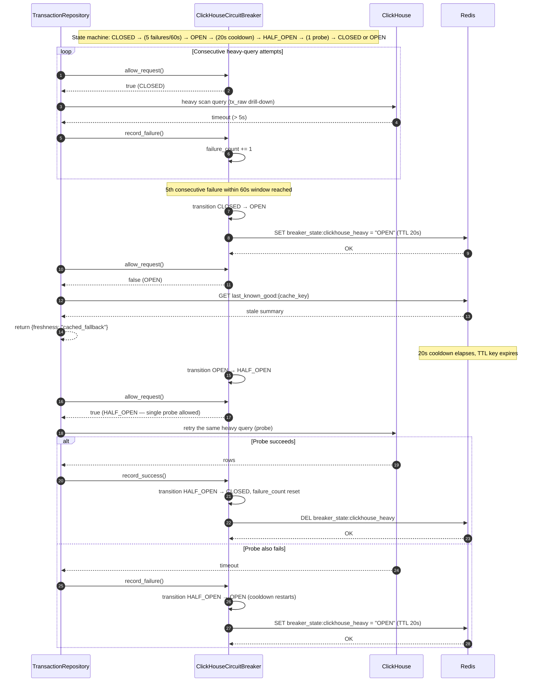

### 19.13 Trigger Agentic Summary (Happy Path)

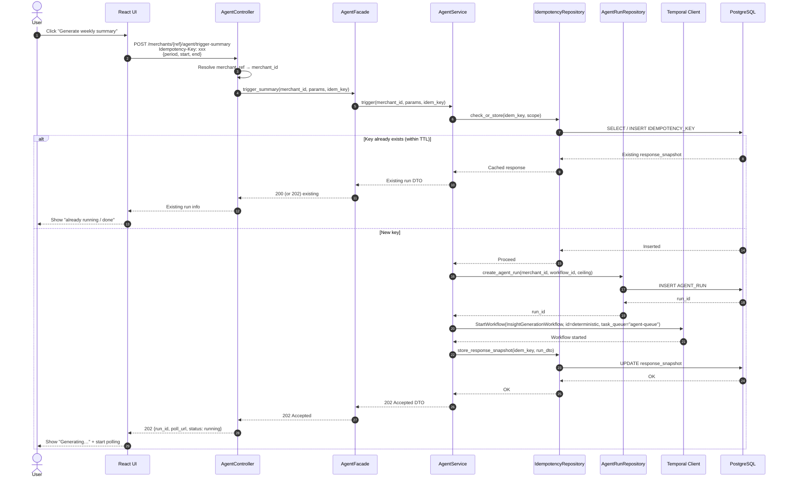

### 19.14 Poll Agent Run Status

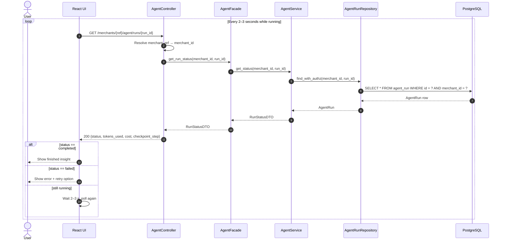

### 19.15 CSV Ingestion (Full Pipeline – Success and Duplicate)

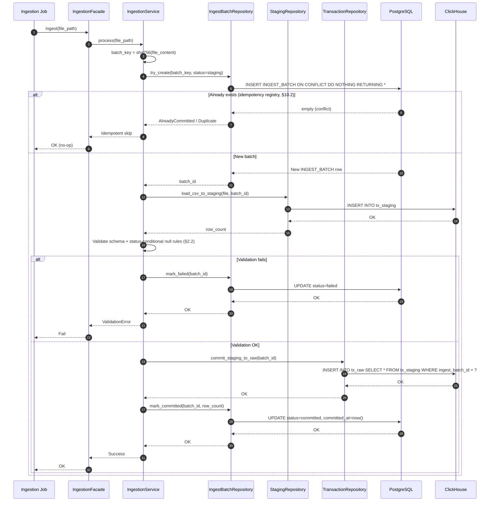

### 19.16 Agent Workflow Internal — LLM Gateway Internals (Adapter + Chain + Breaker + Singleton) + Grounding Retry

```mermaid
sequenceDiagram
    autonumber
    participant TW as Temporal Worker
    participant Orch as InsightOrchestrator
    participant MetricSvc as MetricsService
    participant Chain as ModelRouterChain
    participant Cheap as CheapTierHandler
    participant Mid as MidTierHandler
    participant Ledger as CostLedger «Singleton»
    participant Adapter as AvalAIAdapter
    participant Aval as AvalAI
    participant RunRepo as AgentRunRepository
    participant InsightRepo as InsightRepository
    participant Bus as InsightEventBus
    participant CH as ClickHouse
    participant PG as PostgreSQL

    TW->>Orch: Execute InsightGenerationWorkflow
    Orch->>MetricSvc: FetchMetrics(merchant_id, period)  [checkpoint 1]
    MetricSvc->>CH: -Merge queries
    CH-->>MetricSvc: metrics
    MetricSvc-->>Orch: metrics
    Orch->>Orch: SegmentData  [checkpoint 2]
    Orch->>Orch: DetectCandidateInsights  [checkpoint 3]
    Orch->>Orch: RankByNovelty  [checkpoint 4]

    Orch->>Chain: DraftNarrative(structured prompt)  [checkpoint 5]
    Note over Chain,Ledger: Chain of Responsibility: request enters at the cheapest tier.<br/>Every tier consults the Singleton CostLedger before spending anything.
    Chain->>Cheap: handle(request, Ledger.instance())
    Cheap->>Ledger: can_afford("cheap", estimated_tokens)
    Ledger-->>Cheap: true
    Cheap->>Adapter: complete(request)
    Adapter->>Aval: ChatCompletion (cheap model)
    Aval-->>Adapter: Response
    Adapter-->>Cheap: DraftResponse (structured JSON)
    Cheap->>Ledger: debit("cheap", tokens_in, tokens_out)
    Ledger->>Ledger: Redis INCRBYFLOAT scope=merchant,date; async log to COST_LEDGER_ENTRY
    Ledger-->>Cheap: OK
    Cheap-->>Chain: DraftResponse
    Chain-->>Orch: Draft (structured JSON)

    Orch->>Orch: ValidateAgainstData(draft, metrics)  [checkpoint 6]
    alt Validation fails (invented number / ungrounded claim)
        Note over Orch,Chain: Retry re-enters the SAME checkpoint (5), never re-runs<br/>FetchMetrics/SegmentData/DetectCandidateInsights/RankByNovelty.<br/>This is what makes the retry cheap and correct.
        Orch->>Chain: DraftNarrative(request, previous_failure_reason)  [retry, checkpoint 5]
        Chain->>Cheap: handle(request, Ledger.instance())
        Cheap->>Ledger: can_afford("cheap", estimated_tokens)
        alt Cheap tier still affordable and breaker closed
            Ledger-->>Cheap: true
            Cheap->>Adapter: complete(request)
            Adapter->>Aval: ChatCompletion (cheap model, retry)
            Aval-->>Adapter: Response
            Adapter-->>Cheap: DraftResponse
            Cheap->>Ledger: debit(...)
            Ledger-->>Cheap: OK
            Cheap-->>Chain: DraftResponse
        else Cheap tier exhausted its per-merchant sub-ceiling
            Ledger-->>Cheap: false
            Cheap-->>Chain: decline, delegate
            Chain->>Mid: handle(request, Ledger.instance())
            Mid->>Ledger: can_afford("mid", estimated_tokens)
            Ledger-->>Mid: true
            Mid->>Adapter: complete(request)
            Adapter->>Aval: ChatCompletion (mid model)
            Aval-->>Adapter: Response
            Adapter-->>Mid: DraftResponse
            Mid->>Ledger: debit("mid", tokens_in, tokens_out)
            Ledger-->>Mid: OK
            Mid-->>Chain: DraftResponse
        end
        Chain-->>Orch: Draft (structured JSON)
        Orch->>Orch: ValidateAgainstData(draft, metrics)  [checkpoint 6, retry]
    end

    Orch->>InsightRepo: Publish(insight + provenance)  [checkpoint 7]
    InsightRepo->>PG: INSERT insight + provenance
    PG-->>InsightRepo: OK
    InsightRepo-->>Orch: insight_id
    Orch->>Bus: publish(InsightPublishedEvent(insight_id, merchant_id, kind="agentic_summary"))
    Note over Bus: Fire-and-forget from the Workflow's perspective —<br/>Orchestrator does not wait on notification delivery (§9.5)
    Bus-->>Orch: ack
    Orch->>RunRepo: mark_completed(run_id, tokens, cost)
    RunRepo->>PG: UPDATE status=completed
    PG-->>RunRepo: OK
    RunRepo-->>Orch: OK
    Orch-->>TW: Workflow completed
```

### 19.17 LLM Provider Failover — Chain of Responsibility Deep Dive (All Tiers Degraded)

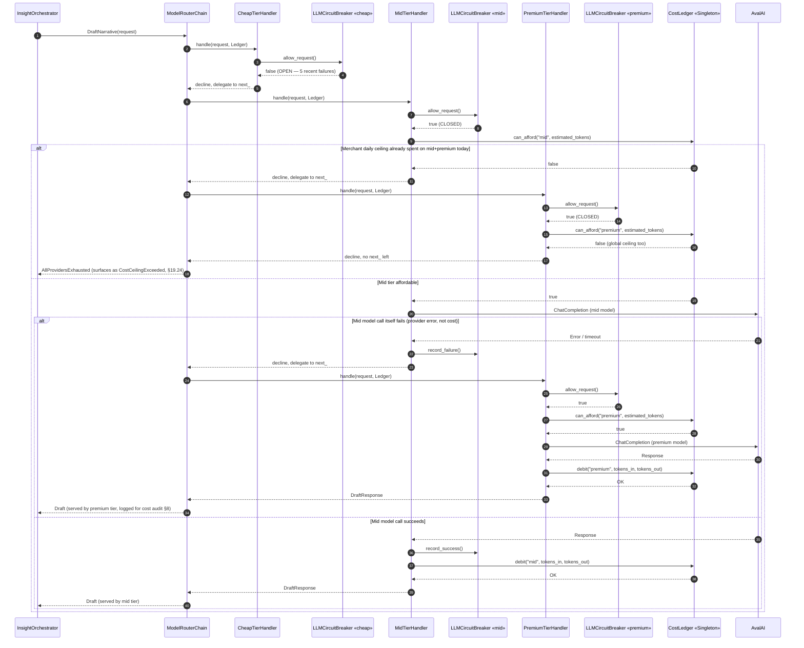

### 19.18 Insight Published → Notification Delivery (Observer)

```mermaid
sequenceDiagram
    autonumber
    participant Src as Publisher<br/>(AnalysisService or InsightOrchestrator)
    participant Bus as InsightEventBus
    participant NotifSvc as NotificationService «subscriber»
    participant CacheListener as CacheInvalidationListener «subscriber»
    participant MerchantRepo as MerchantRepository
    participant NotifRepo as NotificationRepository
    participant Redis as Redis
    participant PG as PostgreSQL
    participant Queue as notification-queue

    Src->>Bus: publish(InsightPublishedEvent{insight_id, merchant_id, kind, severity})
    Note over Bus: Bus fans out synchronously in-process to every registered<br/>subscriber; each subscriber is responsible for making its own<br/>side effects async so a slow subscriber never blocks the publisher.

    par Notification subscriber
        Bus->>NotifSvc: on_insight_published(event)
        NotifSvc->>MerchantRepo: get_notification_preferences(merchant_id)
        MerchantRepo->>PG: SELECT notification_channel, severity_threshold FROM merchant WHERE id = ?
        PG-->>MerchantRepo: preferences
        MerchantRepo-->>NotifSvc: preferences
        alt event.severity below merchant's configured threshold
            NotifSvc-->>Bus: skipped (no-op, no row written)
        else severity clears threshold
            NotifSvc->>NotifRepo: create_pending(merchant_id, insight_id, channel, payload)
            NotifRepo->>PG: INSERT INTO notification (status='pending', ...)
            PG-->>NotifRepo: notification_id
            NotifRepo-->>NotifSvc: notification_id
            NotifSvc->>Queue: enqueue(notification_id)
            Note over Queue: Bulkhead-isolated task queue — a delivery-channel outage<br/>cannot block agent-queue or analysis-queue work
            Queue-->>NotifSvc: enqueued
            NotifSvc-->>Bus: handled
        end
    and Cache-invalidation subscriber
        Bus->>CacheListener: on_insight_published(event)
        CacheListener->>Redis: DEL dashboard_summary_cache:{merchant_id}:*
        Redis-->>CacheListener: OK
        CacheListener-->>Bus: handled
    end

    Note over Queue: Separately, a delivery worker consumes notification-queue,<br/>sends via the channel Adapter, and marks status='sent'|'failed' (§9.5)
```

### 19.19 Workflow Resume After Temporal Worker Crash (Saga Durability)

```mermaid
sequenceDiagram
    autonumber
    participant TW1 as Temporal Worker A
    participant Temporal as Temporal Server
    participant Orch as InsightOrchestrator (workflow logic)
    participant MetricSvc as MetricsService
    participant Chain as ModelRouterChain
    participant TW2 as Temporal Worker B
    participant RunRepo as AgentRunRepository
    participant PG as PostgreSQL

    TW1->>Orch: Execute InsightGenerationWorkflow (workflow_id = {merchant_id}:{period}:{kind})
    Orch->>MetricSvc: FetchMetrics(...)  [checkpoint 1]
    MetricSvc-->>Orch: metrics
    Temporal->>Temporal: record checkpoint 1 in workflow history (durable)
    Orch->>Orch: SegmentData  [checkpoint 2]
    Temporal->>Temporal: record checkpoint 2
    Orch->>Orch: DetectCandidateInsights  [checkpoint 3]
    Temporal->>Temporal: record checkpoint 3
    Orch->>Chain: DraftNarrative(...)  [checkpoint 4, in progress]

    Note over TW1: Worker A process crashes (OOM, deploy, host failure)<br/>mid-way through the DraftNarrative activity, before it returns

    Temporal->>Temporal: detect missed heartbeat on Worker A's activity lease
    Temporal->>Temporal: activity lease expires, task becomes available again
    Temporal->>TW2: dispatch workflow task (same workflow_id, same run) to Worker B

    TW2->>Orch: Resume InsightGenerationWorkflow from workflow history
    Note over Orch: Temporal replays history deterministically:<br/>checkpoints 1–3 are NOT re-executed (their results are<br/>replayed from history), execution resumes exactly at<br/>the incomplete DraftNarrative activity (checkpoint 4)
    Orch->>Chain: DraftNarrative(...)  [checkpoint 4, retried on Worker B]
    Chain-->>Orch: Draft (structured JSON)
    Orch->>Orch: ValidateAgainstData(...)  [checkpoint 5]
    Orch->>RunRepo: mark_completed(run_id, tokens, cost)
    RunRepo->>PG: UPDATE agent_run SET status='completed'
    PG-->>RunRepo: OK
    RunRepo-->>Orch: OK
    Orch-->>TW2: Workflow completed

    Note over PG: AGENT_RUN.checkpoint_state was never left in an ambiguous<br/>state — no duplicate LLM spend occurred for checkpoints 1–3,<br/>and checkpoint 4 was retried exactly once by Temporal's own<br/>at-least-once activity semantics (§9.1, §3 NFR "resumable agent")
```

### 19.20 MCP Tool Call — Write Tool (trigger_agentic_summary)

```mermaid
sequenceDiagram
    autonumber
    participant Agent as ZarinPal Internal Agent
    participant MCP as MCP Server
    participant Fac as AgentFacade
    participant Svc as AgentService
    participant IdemRepo as IdempotencyRepository
    participant RunRepo as AgentRunRepository
    participant TW as Temporal Client
    participant PG as PostgreSQL

    Agent->>MCP: tools/call trigger_agentic_summary {merchant_ref, period, ..., idempotency_key}
    MCP->>MCP: Authenticate (mTLS / API key)
    MCP->>MCP: Resolve merchant_ref → merchant_id
    MCP->>Fac: trigger_summary(merchant_id, params, idem_key)
    Note over Fac,Svc: Exact same path as REST §19.13 — MCP never re-implements<br/>the idempotency/workflow-start logic; it only adapts transport.
    Fac->>Svc: trigger(...)
    Svc->>IdemRepo: check_or_store(...)
    IdemRepo->>PG: ...
    PG-->>IdemRepo: ...
    IdemRepo-->>Svc: ...
    Svc->>RunRepo: create_agent_run(...)
    RunRepo->>PG: INSERT
    PG-->>RunRepo: run_id
    RunRepo-->>Svc: run_id
    Svc->>TW: StartWorkflow(...)
    TW-->>Svc: started
    Svc-->>Fac: 202 DTO
    Fac-->>MCP: Tool result
    MCP-->>Agent: {run_id, status, poll semantics}
```

### 19.21 MCP Tool Call — Read Tool (list_insights)

```mermaid
sequenceDiagram
    autonumber
    participant Agent as ZarinPal Internal Agent
    participant MCP as MCP Server
    participant Fac as AnalyticsFacade
    participant Svc as InsightService
    participant Repo as InsightRepository
    participant PG as PostgreSQL

    Agent->>MCP: tools/call list_insights {merchant_ref, kind, period_start, period_end}
    MCP->>MCP: Authenticate (mTLS / API key)
    MCP->>MCP: Resolve merchant_ref → merchant_id
    alt merchant_ref unresolvable
        MCP-->>Agent: Tool error {code: MERCHANT_NOT_FOUND}
    else Resolved
        MCP->>Fac: list_insights(merchant_id, filters, page=1)
        Note over Fac,Repo: Identical Facade entry point as the REST list endpoint<br/>(§19.5) — same pagination defaults, same AuthZ, same DTO shape,<br/>guaranteeing MCP and REST clients never see divergent results.
        Fac->>Svc: list(merchant_id, filters, page)
        Svc->>Repo: find_by_merchant(merchant_id, filters, page, page_size)
        Repo->>PG: SELECT ... WHERE merchant_id = ? ORDER BY generated_at DESC LIMIT/OFFSET
        PG-->>Repo: Insight rows + total count
        Repo-->>Svc: Page[Insight]
        Svc-->>Fac: Page[InsightDTO]
        Fac-->>MCP: Page[InsightDTO]
        MCP-->>Agent: Tool result {items, total, page}
    end
```

### 19.22 Rate Limiting (Token Bucket, Edge Layer)

```mermaid
sequenceDiagram
    autonumber
    actor Client as UI or MCP Agent
    participant GW as API Gateway (Edge)
    participant RL as RateLimiter (Token Bucket)
    participant Redis as Redis
    participant Ctrl as Controller

    Client->>GW: Any request, identified by api_key_or_user_id
    GW->>RL: check_and_consume(identity, cost=1 or 5)
    RL->>Redis: EVALSHA token_bucket_lua(identity, capacity=60, refill_rate=1/s, cost)
    Note over Redis: Atomic Lua script: reads last_refill_ts + tokens,<br/>computes elapsed-time refill, subtracts cost, writes back —<br/>single round trip, no race between concurrent requests
    alt Bucket has enough tokens
        Redis-->>RL: {allowed: true, remaining_tokens}
        RL-->>GW: allowed
        GW->>Ctrl: forward request
        Ctrl-->>GW: normal response
        GW-->>Client: 200/2xx + X-RateLimit-Remaining header
    else Bucket exhausted
        Redis-->>RL: {allowed: false, retry_after_seconds}
        RL-->>GW: rejected
        Note over GW,Ctrl: Request never reaches the Controller —<br/>no business logic, no DB, no LLM spend is touched
        GW-->>Client: 429 Too Many Requests {error: RATE_LIMITED, retry_after_seconds}
    end
```

### 19.23 Error: Unknown Merchant / AuthZ Failure

```mermaid
sequenceDiagram
    autonumber
    actor User
    participant UI as React UI
    participant Ctrl as AnalyticsController
    participant Fac as AnalyticsFacade
    participant Svc as DashboardService

    User->>UI: Request for non-existent or unauthorized merchant
    UI->>Ctrl: GET /merchants/UNKNOWN/dashboard/summary
    Ctrl->>Ctrl: Resolve merchant_ref
    alt Cannot resolve key → UUID
        Ctrl-->>UI: 404 Merchant not found
        UI-->>User: Error
    else Resolved but AuthZ fails inside Facade
        Ctrl->>Fac: get_dashboard_summary(merchant_id, ...)
        Fac->>Fac: check_object_permission(principal, merchant_id)
        Fac-->>Ctrl: PermissionDenied
        Ctrl-->>UI: 403 Forbidden
        UI-->>User: Access denied
    end
```

### 19.24 Error: Cost Ceiling Exceeded (Singleton CostLedger, during agent run)

```mermaid
sequenceDiagram
    autonumber
    participant Orch as InsightOrchestrator
    participant Chain as ModelRouterChain
    participant Ledger as CostLedger «Singleton»
    participant Redis as Redis
    participant RunRepo as AgentRunRepository
    participant PG as PostgreSQL

    Orch->>Chain: DraftNarrative(...)
    Note over Chain,Ledger: Every tier handler in the chain independently asks the<br/>same Singleton instance — there is exactly one source of<br/>truth for "how much has this merchant/global scope spent today"
    Chain->>Ledger: can_afford("cheap", estimated_tokens)
    Ledger->>Redis: GET merchant_spend:{merchant_id}:{today} + GET global_spend:{today}
    Redis-->>Ledger: current_merchant_spend, current_global_spend
    Ledger->>Ledger: (current_merchant_spend + estimate) > merchant_ceiling? OR (current_global_spend + estimate) > global_ceiling?
    Ledger-->>Chain: false (ceiling would be exceeded)
    Chain->>Chain: delegate to mid, then premium — same check repeats and fails identically for each tier (§19.17)
    Chain-->>Orch: AllProvidersExhausted / CostCeilingExceeded
    Orch->>RunRepo: mark_failed(run_id, reason="cost_ceiling")
    RunRepo->>PG: UPDATE agent_run SET status='failed', ...
    PG-->>RunRepo: OK
    RunRepo-->>Orch: OK
    Orch-->>Orch: Workflow fails cleanly (no further LLM spend, no partial insight published)
```

---

*End of Specification v1.4*
